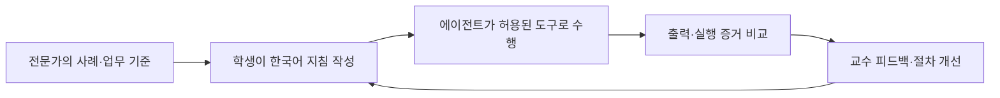
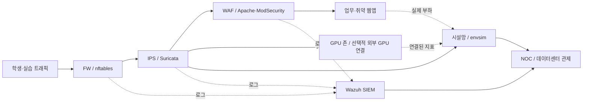
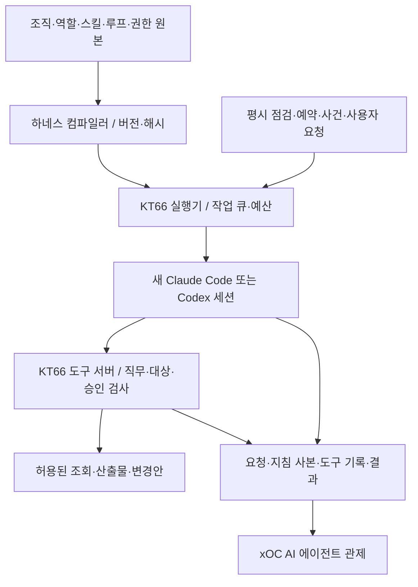

# KT66 — AI 데이터센터 운영·에이전트 교육 플랫폼

**데이터센터를 운영하고, 전문가의 일하는 방법을 AI 에이전트에게 가르치는 실습 환경입니다.**


KT66은 한 대의 Linux 서버에 보안 인프라, 업무 서비스, 가상 시설, 관제 화면과 역할별 AI 근무자를 함께 구성합니다. 학생은 장애와 업무 요청을 접수하고, 증거를 조사하고, 변경을 검토하고, 복구 결과를 확인하는 운영 과정을 경험합니다.

핵심은 **전문가의 경험을 자연어 업무 절차로 옮기고 실행 결과로 검증하는 것**입니다. 한국어로 작성된 역할·스킬·일정·정책을 수정하면서, 에이전트가 무엇을 조회하고 어떻게 판단하며 어떤 근거를 보고하는지 비교할 수 있습니다. 시설 운영, 시스템·네트워크, SOC, AI 서비스 운영과 에이전트 설계를 하나의 환경에서 연결합니다.

[교수·강사용 매뉴얼](docs/INSTRUCTOR-GUIDE.ko.md) · [학생용 매뉴얼](docs/STUDENT-GUIDE.ko.md) · [에이전트 운영 상세](docs/AGENT-OPERATIONS.ko.md) · [업무 요청·대화](docs/USER-REQUESTS.ko.md)

> 교육용 단일 호스트 실습 환경입니다. 취약 웹앱과 실제 장애 주입 기능을 포함하므로 수업용으로 격리된 서버·네트워크에서 운영합니다. 아래 구성 수와 기본값은 저장소 설정 기준이며, 모든 기능의 운영 검증 완료를 의미하지 않습니다.

## 무엇을 할 수 있나요?

| 활용 영역 | 실습 내용 | 확인할 결과 |
|---|---|---|
| 데이터센터 운영 | 전력·냉방·출입 상태와 서버 부하를 함께 관찰 | 설비 이상, 서비스 영향, 대응 우선순위 |
| 시스템·네트워크 | 실제 디스크 용량, 컨테이너 상태, 자산 IP, 방화벽 정책 조사 | 조회 시각·대상·원본 증거와 미확인 범위 |
| 보안 운영 | Wazuh 경보 분석, FW·IPS·WAF 관측, 사건 조사 | 실제 공격·오탐·보류 판정과 근거 |
| AI 서비스 운영 | 모델 설정·지식 자료 수정, 평가, 버전 배포와 지표 비교 | 응답 품질·거부·지연·문맥 제한의 변화 |
| 자연어 업무 처리 | 근무자에게 질문하거나 여러 담당자의 협업 업무 요청 | 계획, 담당 역할, 산출물, 검토·적용 상태 |
| 장애 대응 훈련 | 시설 고장과 IT 장애를 주입하고 복구 | 탐지 → 조사 → 승인 → 조치 → 사후 확인 |
| 에이전트 설계 | 한국어 지침과 권한·예산을 바꿔 같은 업무 재실행 | 출력·도구 사용·판단 근거·사용량의 차이 |

예를 들어 시스템 담당에게 “디스크가 80% 이상 찬 시스템을 확인해 줘”라고 묻거나, SOC 분석가에게 “최근 5시간 경보를 분석하고 근거를 요약해 줘”라고 요청할 수 있습니다. 복합 업무는 **업무 요청**에서 계획과 담당자를 구성합니다. 정적 홈페이지 개발·WAF 아래 배포, 지정 페이로드의 WAF 변경안 준비도 지원합니다. 실제 적용은 검증과 사람의 승인을 거칩니다.

<a id="agent-learning"></a>

## 교육에 활용하는 방법

학생은 기본 지침으로 먼저 실행한 뒤, 전문가가 제공한 조사 순서·판단 기준·협업 조건을 반영해 다시 실행합니다. 결과 문장뿐 아니라 **실제로 조회한 자료, 사용한 도구, 판단의 한계, 권한 준수, 후속 작업**을 평가합니다.



- **교수·강사:** 실습 환경과 시나리오를 준비하고, 학생에게 역할·과제를 배정하며, 증거를 기준으로 평가합니다. [설치부터 수업 운영까지](docs/INSTRUCTOR-GUIDE.ko.md)
- **학생:** 관제와 담당자 대화부터 시작해 스킬을 수정하고, 같은 입력의 전후 결과를 비교합니다. [첫 실습과 SOC 설정 예제](docs/STUDENT-GUIDE.ko.md)
- **운영자·개발자:** 조직·권한·일정·실행기와 도구를 확장합니다. [실행기 구조](agents/RUNNER.md), [직무 분리와 위험 설계](docs/agent-security-design.ko.md)

SOC 예제에는 단순 조회, 특이 사건 조사, 하루 두 번 종합 분석을 구분한 기본 지침이 들어 있습니다. 월간 위험 분석과 신규 위협의 규칙 관리 절차는 별도 확장 예제로 제공하며 자동 실행에는 연결하지 않았습니다.

## 시스템 구조

서비스 API와 실행기는 Python·FastAPI, 작업 큐와 운영 이력은 SQLite, 화면은 HTML/CSS/JavaScript로 구성합니다. Docker Compose가 서비스와 실습 네트워크를 묶고, Claude Code·Codex와 내부 도구 서버는 MCP로 연결합니다.

### 실제 인프라와 시설 시뮬레이션

학생의 실습 웹 트래픽은 **FW → IPS → WAF → 업무 앱** 경로를 사용합니다. nftables, Suricata, Apache·ModSecurity, Wazuh와 Docker 컨테이너가 실제로 동작합니다. 전력·냉방·소방·출입 설비는 시뮬레이션이며, 수집 가능한 실제 CPU·GPU 사용률을 모델 입력으로 사용합니다. 화면의 환산 전력·온도를 물리 센서 실측값으로 해석하지 않습니다.



관리 콘솔은 별도 호스트 포트로도 접속합니다. 위 그림은 실습 트래픽의 주 경로이며 모든 관리·호스트 접근을 나타내지는 않습니다.

| 층 | 교육 영역 | 주요 구성 |
|---|---|---|
| 옥외 부지 | 외부 전원·방열·출입 경계 | 발전기·연료탱크·냉각탑·분산 전원 등 12개 설비, 층과 분리 |
| B1 지하 설비층 | 전력, 냉방, 소방 | 전기실·UPS·배터리실, 냉동기·펌프, 소화용기실 |
| 1F 보안 로비 | 방문 안내, 물리보안, 방재 수신 | 안내·대기 공간, 정문 → 검색대 → 맨트랩 → 층간 이동 |
| 2F 일반 전산실 | 시스템, 스토리지, 네트워크, 보안 | FW·IPS·WAF, 업무 앱, 서버·디스크 조사 |
| 3F AI 전산실 | GPU 플랫폼, 추론 서비스, 모델 운영 | NVIDIA 7대 공랭 구역, 별도 액냉 비교 실습 구역, 서비스·모델 상태 조회 |
| 4F 운영 사무실 | 업무 조정, 개발, 검토·감사 | 서비스데스크·개발·감사, 운영리드 독립실 |
| 5F AI 연구소 | 전문가 방법론 연구·스킬 개발·독립 평가 | 스킬 연구원·평가원, 품질·안전·실측 토큰 비교 |
| xOC 제한구역 | AI Agent Operations Center + SOC | AI 에이전트 관제원·SOC 분석가, 실제 층 번호는 보관·공개하지 않음 |

전체 화면은 층별 분해도입니다. 화면 비율에 맞춰 층·옥외·xOC를 배치하고 실제 그림 윤곽 사이의 간격을 확보해 여백과 가림을 줄입니다. 층을 클릭하면 상세 공간으로 들어갑니다. 3층은 NVIDIA 공랭 랙의 전면 정비 통로와 출입 동선을 확보하고, 전원·방재 설비와 액체냉각 비교 실습 구역을 분리합니다. 공간 배치는 교육용 상대 좌표이며 시공 도면이 아닙니다.

**층은 물리 배치, 존은 네트워크 구획입니다.** 자산 대장 [envsim/assets.yaml](envsim/assets.yaml)에 층·존·설비·자산을 정의합니다.

설비를 클릭하면 역할·계통·설계값·시뮬레이션 상태·고장 영향·점검 항목을 확인합니다. AI 장비를 클릭하면 등록된 서빙 플랫폼과 모델 정보를 읽기 전용으로 조회합니다. [시설·AI 장비 안내](docs/noc-facilities-and-ai.md)에 배치 가정, 실측과 모델값의 구분, 학생이 수정할 파일과 플랫폼 등록법을 정리했습니다.

| 존 | 대역 | 용도 |
|---|---|---|
| `ext` | `10.20.30.0/24` | 외부 접점·공격자·점프 호스트 |
| `pipe` | `10.20.31.0/24` | FW–IPS 검사 구간 |
| `dmz` | `10.20.32.0/24` | WAF·SIEM·운영 서비스 |
| `int` | `10.20.40.0/24` | 업무 앱 |
| `app` | `10.20.50.0/24` | GPU·AI 서비스 |
| `gpu-external` | 별도 내부 대역 없음 | 추가 실물 NVIDIA 장비의 외부 관리 주소 구분 |
| `ot` | `10.20.60.0/24` | 시설 시뮬레이터 |
| `mgmt` | 별도 대역 없음 | 논리적인 운영 권한 구분 |

### 에이전트 실행 구조

현재 [roster.yaml](agents/roster.yaml)은 **근무자 13명**, 연결된 업무 루프는 **15개**입니다. 시설, 물리보안, 네트워크, 시스템/스토리지, GPU, SOC, 서비스데스크, 운영 총괄, 감사, 애플리케이션 개발, 스킬 연구·평가, AI 에이전트 관제 역할을 나눕니다.



Claude와 Codex는 **KT66이 생성하는 실행 환경을 통해 같은 원본을 사용**합니다. 일반 CLI가 저장소의 모든 persona와 루프를 자동 인식한다는 의미는 아닙니다. 역할별로 새 구독 CLI 세션을 배정하고, 여러 담당자의 작업 순서와 결과 회수는 KT66이 관리합니다.

근무자 추론에는 호스트 사용자의 Claude·ChatGPT 구독 로그인을 사용합니다. Ollama/GPU는 학생이 운영하는 서비스이며, 현재 근무자 런타임과는 별개입니다.

모델 운영 실습은 Ollama가 연결되지 않으면 모의 백엔드로도 진행할 수 있습니다. 모델 설정과 지식 자료의 영향을 비교하되, 모의 결과와 실제 모델 응답을 구분합니다.

## 설계의 강점

| 설계 | 구현 방식 | 실습에서 얻는 효과 |
|---|---|---|
| 공통 원본과 실행 재현 | 조직·정책·역할·연결 스킬을 버전·해시와 함께 보존 | 어느 지침으로 실행했는지 전후 비교 가능 |
| 서버가 강제하는 직무 분리 | 도구 목록과 실제 호출에서 직무·자산·승인 검사 | 네트워크 담당이 디스크나 SOC 로그까지 임의 조회하는 것을 방지 |
| 필요한 업무만 모델에 요청 | 평시 코드 점검, 변화 시 AI 호출, 상세 스킬의 선택적 로딩 | 무변화 감시와 불필요한 컨텍스트 입력 감소 |
| 복구 가능한 실행 관리 | SQLite 작업 큐, 중복 억제, 재시도·한도 대기·재시작 복구 | 세션 실패와 업무 완료를 구분하고 이력 추적 |
| 검증된 변경안의 적용 | 산출물 고정·해시, 격리 검사, 승인 후 적용·확인·되돌리기 | 요청과 운영 변경 사이의 검토 과정을 학습 |
| 근거 중심의 에이전트 관제 | 에이전트 보고·도구 관측·실행기 기록을 구별 | “완료했다”는 답변을 실제 증거와 대조 |
| 자산과 실습의 연결 | 공통 자산 대장, 시나리오 검증, 실제 상태 검사 | 문서에만 존재하는 자산·완료 조건을 식별 |

평시 감시 루프 7개는 **10분 → 5분 → 2분 → 1분**으로 점검 간격을 조정하고, 안정되면 점차 복귀합니다. 변화 없는 코드 점검에는 모델을 호출하지 않습니다. 별도 정기 보고·사용자 요청·사건 대응은 구독 사용량을 소비합니다.

관제에는 요청, 트리거, 상황·판단 요약, 계획, 도구 입출력, 확인 가능한 파일 접근, 결과, 재시도와 사용량이 남습니다. 모델의 비공개 내부 추론이나 OS 전체 접근 기록을 수집하는 기능은 아닙니다. [관제 범위와 증거 해석](docs/AGENT-CONTROL.ko.md)

NOC의 **리스크·권한 관제** 탭에서는 실제 실행 기록에 따라 근무자가 12개 논리 구역으로 이동합니다. 접근 거절·승인 대기는 경계에 표시하고, 과거 활동을 재생하여 권한과 근거를 조사할 수 있습니다. xOC·SOC 대시보드는 반복 경보를 묶고 주요 사건, 시간대·출발지·도구·토큰 통계를 먼저 보여줍니다. 전체 사건과 Markdown 보고서는 별도 검색 목록에서 찾습니다.

에이전트 로그·탐지·보고서는 기존 Wazuh와 구분된 **SIEM 전용 인덱스**에 저장합니다. 수집·조회 계정을 분리하고 장애 시 전송 대기열에서 재시도합니다. 관제 화면과 수집기는 모델을 호출하지 않습니다. [화면 사용법·12개 구역·SIEM 저장 구조·Luvus 검토](docs/OBSERVABILITY.ko.md)

### 연구소와 xOC의 개선 순환

연구원은 공개 문헌·실무 사례를 조사해 한국어 스킬 후보를 등록하고, 평가원은 동일 사례를 기존/후보 스킬에 각각 제공하여 품질·안전·실측 토큰·시간을 비교합니다. 강사는 평가를 통과한 후보의 변경 내용을 검토해 담당자에 적용하고 필요하면 이전 상태로 복구합니다. 일반 스킬 편집 화면도 계속 사용할 수 있습니다.

신규 근무자는 **Codex Astra/high(연구), Sol/medium(평가), Luna/medium(관제)**를 사용합니다. 연구는 하루 한 번, 평가는 후보가 있을 때만 실행합니다. 신규 역할에는 24시간 자동 작업 시작 한도(연구 1·평가 3·관제 4)를 두며, A/B 평가 작업 하나에는 모델 호출 두 번이 포함됩니다. 구독 로그인은 기존 Codex 설정을 공유하며 API 과금으로 자동 전환하지 않습니다.

xOC는 실제 도구 영수증을 11개 규칙으로 먼저 검사합니다. 권한 경계 위반·반복 호출·예산 초과·오류·근거 공백·인젝션 의심·민감정보 형식·증적/사용량 누락을 조사하고, 검증된 직무 위반에 한해서만 관제원이 대상의 **새 실행·다음 도구 호출을 최대 15분 보류**할 수 있습니다. 스킬 변경·보류 해제는 독립 검토를 거칩니다. [운영 방법·위험 모델·자료별 구현 대응](docs/AI-RESEARCH-XOC.ko.md)

## 설치

### 준비

Linux·systemd·Docker Engine/Compose를 사용하는 전용 서버 또는 VM을 준비합니다. 호스트에는 Git, Python 3.10 이상·PyYAML, Node.js, curl·OpenSSL 등이 필요합니다. Wazuh를 포함한 전체 스택은 메모리와 디스크 여유가 필요하므로 [교수용 설치 안내](docs/INSTRUCTOR-GUIDE.ko.md#installation)의 사전 점검을 따릅니다.

[Compose](docker-compose.yaml)에는 **서비스 28개**가 정의되어 있으며, 초기 작업 후 종료되는 서비스도 포함됩니다. 외부 GPU는 선택 사항입니다. GPU 연결이 없으면 관련 실측·장애 실습 범위가 제한됩니다.

### 1. 저장소와 서버별 설정

아래는 새 설치 기준입니다. 기존 서버의 `.env`와 데이터는 덮어쓰지 않습니다.

```bash
mkdir -p ~/work
git clone https://github.com/mrgrit/kt66.git ~/work/kt66
cd ~/work/kt66
cp .env.example .env
chmod 600 .env
nano .env
```

`.env`에서 다음 값을 설정합니다.

| 설정 | 의미 |
|---|---|
| `WEB_HOST_IP` | 학생이 접속할 서버의 실제 IP |
| `INT_HOST_IP` | 관리 콘솔 바인딩 IP. 간단한 수업 구성에서는 서버의 같은 실제 IP 사용 |
| `API_KEY` | 강사·관리 화면의 제어 키. 예제 문자열을 임의의 긴 값으로 교체 |
| `SSH_USER`, `SSH_PASS` | 실습 컨테이너 SSH 계정. 예제 기본값 변경 |
| `TZ` | 컨테이너 시간대. 기본 `Asia/Seoul` |

`openssl rand -hex 32`로 제어 키 후보를 생성할 수 있습니다. **이 키는 Claude/Codex 모델 API 키나 구독 로그인 값이 아닙니다.**

### 2. 인프라 기동

```bash
./kt66.sh install
./kt66.sh up
docker compose -f docker-compose.yaml ps -a
sudo ./kt66-net.sh --check
```

일반 호스트 사용자로 시작하며 필요한 단계에서 sudo를 사용합니다. `install`은 Docker 데몬 설정을 바꾸고 Docker를 재시작합니다. `up`은 인증서·컨테이너·호스트 네트워크·관련 systemd 서비스를 준비합니다. 기존 업무 서버에 설치하기 전에 그 영향을 확인합니다. Docker 그룹 권한을 새로 부여했다면 재로그인합니다.

### 3. 구독 로그인과 근무자 실행기

**컨테이너 기동만으로 AI 근무자 실행기가 설치되지는 않습니다.** 기본 명단은 Claude와 Codex를 함께 사용하므로 두 CLI를 준비하거나, 사용 가능한 런타임에 맞춰 명단을 조정해야 합니다.

[교수용 매뉴얼의 CLI 설치·로그인](docs/INSTRUCTOR-GUIDE.ko.md#subscription-login)을 따라 **러너를 실행할 일반 사용자 계정**으로 로그인합니다. 이어 기본 설치 경로인 `~/work/kt66`에서 다음을 실행합니다.

```bash
python3 agents/agentctl list
python3 agents/agentctl render --all
mkdir -p ~/.config/systemd/user
cp agents/kt66-runner.service ~/.config/systemd/user/
systemctl --user daemon-reload
systemctl --user enable --now kt66-runner.service
systemctl --user status kt66-runner.service
```

다른 경로에 설치했거나 CLI 실행 경로가 다르면 서비스 파일의 `WorkingDirectory`, `ExecStart`, `PATH`를 먼저 수정합니다. 로그아웃 후 계속 실행할 때의 설정과 점검 절차도 교수용 매뉴얼에 있습니다.

## 접속과 기본 사용법

아래 `관리 IP`는 `INT_HOST_IP`, `웹 IP`는 `WEB_HOST_IP`입니다. 포트는 Compose 기본값입니다.

| 화면 | 주소 | 용도 |
|---|---|---|
| **데이터센터 관제** | `http://<관리 IP>:8020/` | 여기서 시작: 건물·층·자산·근무자 |
| **리스크·권한 공간 관제** | `http://<관리 IP>:8020/?view=risk` | 12개 위험 평가축·실제 활동 이동·경계·기록 재생 |
| **AI 에이전트 관제** | `http://<관리 IP>:8020/agent-control` | 실행 조사·증거·사용량 |
| **AI 연구소** | `http://<관리 IP>:8050/research-lab` | 스킬 후보·독립 A/B 평가·검토 후 적용·복구 |
| **xOC 통합관제** | `http://<관리 IP>:8050/xoc` | 주요 경보·SIEM 통계·반복 사건 묶음·판정·보고서함 |
| **SOC 보안 관제** | `http://<관리 IP>:8050/soc` | Wazuh 경보 수준·시간대·출발지·규칙별 집계 |
| **근무자 운영** | `http://<관리 IP>:8050/` | 회사·부서·팀·R&R·스킬·루프·권한 |
| **업무 요청·근무자 대화** | `http://<관리 IP>:8050/requests` | 질문·협업 업무·산출물·변경안 |
| 모델 운영 | `http://<관리 IP>:8060/` | AI 서비스 설정·평가·배포 |
| 인프라 요구사항 | `http://<관리 IP>:8070/` | 요구서와 실제 상태의 수용 기준 비교 |
| 관리 포털 | `http://<관리 IP>:8000/` | 자산·기존 운영 기능 |
| Wazuh | `https://<관리 IP>:5601/` | SIEM 경보 조사 |
| FW·IPS·WAF GUI | `http://<관리 IP>:8081/`, `:8082/`, `:8083/` | 보안장비별 관측·실습 |
| 시설·IT 주입 API | `http://<관리 IP>:8010/docs`, `:8030/docs` | 시뮬레이터·장애 주입기 |
| 실습 웹 서비스 | `http://<웹 IP>/`, `:8001`~`:8007` | 랜딩·업무·취약 웹앱 |

이름으로 접속하는 `noc.kt66.lab` 등의 hosts 설정은 [교수용 접속 안내](docs/INSTRUCTOR-GUIDE.ko.md#access)에 있습니다. 관리 콘솔 프록시는 WAF 실습 검사에서 제외되므로 접근 통제는 별도로 관리합니다.

1. **관찰:** NOC에서 층·자산·현재 경보와 근무자 상태를 확인합니다.
2. **질문:** 캐릭터의 **말 걸기** 또는 **근무자 대화**에서 담당자에게 조회를 요청합니다.
3. **업무:** 개발·변경·여러 담당자의 협업은 **업무 요청**에서 목표와 범위를 제출합니다.
4. **확인:** 답변의 조회 기록과 xOC와 실행 증적 화면에서 실제 도구 결과·근거·누락 사항을 확인합니다.
5. **개선:** 근무자 운영의 스킬 라이브러리에서 업무 절차를 수정·연결하고 같은 조건의 새 대화·요청으로 비교합니다.

직무 안에서 승인이 필요한 도구에는 **이번만 허용 / 항상 허용 / 요청 보류**를 선택할 수 있습니다. 직무 밖 도구는 허용할 수 없으며 담당자를 안내합니다. 예를 들어 네트워크 담당에게 디스크 조회를 요청하면 시스템/스토리지 담당으로 안내하는 것이 정상입니다.

## 주요 디렉터리와 설정

| 경로 | 역할 |
|---|---|
| [docker-compose.yaml](docker-compose.yaml), [kt66.sh](kt66.sh) | 전체 서비스·네트워크·볼륨 정의와 설치·기동 |
| [.env.example](.env.example), `.env` | 서버별 접속·인증 설정 예시와 로컬 실제 값 |
| [envsim/](envsim/) | 시설 엔진·경보·자산 대장 |
| [noc/](noc/) | 데이터센터 시각화와 에이전트 실행 관제 |
| [agents/](agents/), [agentops/](agentops/) | 에이전트 원본·컴파일러·실행기·도구 / 웹 운영·업무 요청 |
| [fw/](fw/), [ips/](ips/), [web/](web/) | 방화벽·IPS·WAF 및 업무 서비스 진입 |
| [wazuh-config/](wazuh-config/), [siem/](siem/), [sigma/](sigma/) | SIEM·수집·탐지 규칙 |
| [observability/](observability/) | 에이전트 전용 SIEM 초기화·증적 변환·지속 전송 대기열 |
| [injector/](injector/), [scenarios/](scenarios/) | 실제 IT 장애 주입 / 교육 시나리오·검증 |
| [modelops/](modelops/), [gpu-gw/](gpu-gw/) | 모델 운영 실습 / 외부 GPU 연결 |
| [infraops/](infraops/), [portal/](portal/), [assessor/](assessor/) | 인프라 요구사항 검사·관리 포털·기존 평가 기반 |
| [vuln-sites/](vuln-sites/), [bastion/](bastion/), [ui/](ui/) | 실습 앱·점프 호스트와 기존 도구·공통 UI |
| [docs/](docs/) | 교수·학생·운영·보안 설계 문서 |

**에이전트 설정은 “일하는 방법 / 실행 시점 / 실제 권한”으로 나눠 읽으면 됩니다.**

| 바꿀 내용 | 원본 |
|---|---|
| 조직 목적·책임·협업 | [company.yaml](agents/company.yaml), [departments.yaml](agents/departments.yaml), [teams.yaml](agents/teams.yaml) |
| 담당자·런타임·모델·루프 연결 | [roster.yaml](agents/roster.yaml) |
| 짧은 역할과 스킬 선택 기준 | [personas/](agents/personas/) |
| 상세 업무 절차 | [native/.agents/skills/](agents/native/.agents/skills/)의 `SKILL.md` |
| 언제 무엇을 점검·보고할지 | [loops/](agents/loops/) |
| 실제 권한·대상·자율성·예산·시간대 | [harness.yaml](agents/harness.yaml) |
| xOC 탐지 기준·위험·대응 | [xoc/rules.yaml](agents/xoc/rules.yaml) |
| 관제 구역·도구의 평가축·노출 등급 | [xoc/risk-zones.yaml](agents/xoc/risk-zones.yaml) — 권한 부여와 구분 |
| 연구 출처·격리 평가 사례 | [research/sources.yaml](agents/research/sources.yaml), [research/benchmarks.yaml](agents/research/benchmarks.yaml) |
| 사용자 업무의 공통 지침 | [native/AGENTS.md](agents/native/AGENTS.md) |
| 자동 실행하지 않는 학습 예시 | [examples/soc/](agents/examples/soc/) |

웹에서는 **근무자·R&R**에서 역할과 담당 범위를, **일하는 방식 → 스킬 라이브러리**에서 스킬 추가·수정·삭제·연결을 관리합니다. **적용**에서 원본과 실행 사본의 일치를 확인합니다. [화면과 파일 대응·사용법](docs/AGENT-CONFIGURATION.ko.md)

`agents/runtimes/`는 생성된 실행 사본, `agents/evidence/`는 실행 증거, `agents/tickets/`는 큐·요청·승인·회차 상태입니다. 지침을 바꿀 때 생성물이나 증거를 수정하지 않고 원본을 편집합니다. 상세 작성법과 Claude/Codex 공유 방식은 [학생용 매뉴얼](docs/STUDENT-GUIDE.ko.md#agent-files)에 있습니다.

## 현재 구현 범위

- 시설 고장과 실제 IT 장애 주입을 함께 제공합니다. [교육 시나리오](scenarios/README.md)의 `ready / partial / planned`를 확인하고 과제를 선택합니다. 카탈로그에 있다는 이유만으로 전체 자동 대응·채점이 완성된 것은 아닙니다.
- SIEM 조회는 보관된 경보와 도구의 조회 범위에 한정됩니다. 전체 접근 로그의 장기 집계, IP 평판·지역 정보, 정식 위험 점수 계산기는 별도 연동이 필요합니다.
- 홈페이지 업무는 **정적 HTML/CSS/JavaScript** 배포를 지원합니다. 서버 프로그램·DB·실결제와 범용 SIEM/IPS 규칙 자동 등록은 현재 실행 기능에 포함되지 않습니다.
- xOC는 최근 72시간·회차 최대 300개 실행을 코드로 검사하고, 변화·이상이 있을 때 관제 에이전트를 호출합니다. 인젝션 키워드·형식 검사만으로 모든 오용이나 환각을 탐지하지는 않습니다.
- 직무 정책은 에이전트 도구 경로에서 강제합니다. 공용 호스트 계정·Docker 권한·강사 키를 사용하는 교육 환경이며, 학생별 비공개 데이터 격리나 운영용 다중 사용자 인증을 제공하지 않습니다.

자세한 지원 범위는 [업무 요청](docs/USER-REQUESTS.ko.md), [보안 설계와 잔여 위험](docs/agent-security-design.ko.md), [에이전트 관제](docs/AGENT-CONTROL.ko.md)를 참고하세요.

## 문서 길잡이

| 문서 | 읽는 목적 |
|---|---|
| [교수·강사용 매뉴얼](docs/INSTRUCTOR-GUIDE.ko.md) | 설치·로그인·운영·수업 설계·장애 주입·평가·복구 |
| [학생용 매뉴얼](docs/STUDENT-GUIDE.ko.md) | 화면 사용·담당자 질문·지침 작성·SOC 예제·전후 비교 |
| [근무자 설정·R&R·스킬 관리](docs/AGENT-CONFIGURATION.ko.md) | 화면과 파일 대응·추가·연결·삭제·복원·적용 확인 |
| [에이전트 운영 상세](docs/AGENT-OPERATIONS.ko.md) | 조직 상속·루프·승인·큐·운영 명령·장애 진단 |
| [실행기 요약](agents/RUNNER.md) | 현재 런타임과 구현 경로 |
| [업무 요청과 대화](docs/USER-REQUESTS.ko.md) | 작업 분해·임시 역할·대화 승인·산출물 적용 |
| [AI 에이전트 관제](docs/AGENT-CONTROL.ko.md) | 증거 수준·관제 화면·조회 API·탐지 규칙 |
| [직무 권한 분리·위험 평가](docs/agent-security-design.ko.md) | 위협·통제·검증·남은 위험 |
| [시나리오 안내](scenarios/README.md), [교육 카탈로그](docs/시나리오_카탈로그.md) | 구현 상태·과제 선택·주차별 배치 |

KT66은 [el34](https://github.com/mrgrit/el34)의 단일 호스트 보안 실습 기반을 확장한 프로젝트입니다. [이관 전 README](README.el34-inherited.md)와 이전 어댑터 설명은 역사적 참고 자료이며, 현재 설치·실행은 위 안내를 기준으로 합니다.
