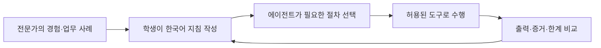

# kt66 — AI데이터센터 운영 교육 인프라

전문가의 작업 방식을 자연어 지침으로 작성하고, 에이전트의 출력과 실행 증거를 비교하며
데이터센터 운영을 배우는 실습 환경이다. 처음에는 기본 설정으로 시작하고 학생이 역할별
업무 절차를 구체화한다. **[SOC 예제로 배우는 지침 작성과 비교 실습](#agent-learning)**부터 읽는다.

## 에이전트 운영 문서

[한국어 상세 운영 매뉴얼](docs/AGENT-OPERATIONS.ko.md)에서 조직·근무자 설정, 하네스 로딩, 12개 루프, 승인·복구 검증과 운영·장애 진단을 설명합니다. 현재 구독 CLI 실행 기준은 이 매뉴얼과 [운영 요약](agents/RUNNER.md)을 따릅니다.


학생 1인당 서버 1대에 **미니 AI데이터센터**를 통째로 세운다. 망분리된 인프라, 가상 시설
계통(전력·냉방·소방·물리보안), GPU 추론 서비스, 그리고 각 층에서 일하는 **근무자 에이전트**까지
한 스택에 들어간다. 15주 교육과정(구축 → 운영 → 대응·자동화)의 실습 무대다.

> **베이스는 [el34](https://github.com/mrgrit/el34)다.** kt88 이 아니다.
> el34 에는 관리 포털(`portal/`), 에이전트 하네스(`bastion/`), 자동 채점·시나리오 주입
> (`assessor/`)이 이미 있고 **단일 호스트** 구성이라 1인 1대 배정과 맞는다. kt88 은
> 3대 macvlan 확장판이라 이 용도에는 불필요한 복잡도가 된다.
> 다만 GPU 서버를 엔드포인트로 붙이는 방식은 kt88 의 접근을 이어받는다(아래 GPU 존).

<a id="agent-learning"></a>

## 전문가의 일하는 방식을 에이전트에게 이식하는 실습

이 시스템의 교육 목표는 **전문가가 무엇을 보고, 어떤 순서로 판단하고, 누구에게 일을
넘기며, 무엇을 확인한 뒤 완료하는지를 학생이 자연어로 표현하고 실행 결과로 검증하는 것**이다.
학생은 현장에서 접하기 어려운 데이터센터·보안 운영 업무를 에이전트의 업무 흐름으로
읽고, 세부 지침을 바꾸고, 에이전트의 출력과 실제 도구 사용이 어떻게 달라지는지 관찰한다.

처음에는 저장소에 포함된 **기본 업무 지침**으로 시작한다. 수업이 진행되면 학생이
담당 역할의 조사 순서·판단 근거·보고 방식·협업 조건을 구체화한다. 강사는 전문 업무의
사례와 기준을 제공하고, 학생은 그 기준을 실행 가능한 업무 절차로 옮긴다. 학생은 이 과정에서
에이전트에 전달할 **지침·자료·도구·권한을 구성하는 방법**을 배운다.



학습 결과는 보고서의 표현뿐 아니라 **조회 범위, 사용한 증거, 판단의 변화, 미확인 사항,
권한 준수, 후속 작업, 비용**으로 평가한다. 결과가 더 길거나 더 자신 있게 쓰였다고
업무가 개선된 것은 아니다. 작은 수정의 효과를 바로 비교하는 실습부터 시작한다.

바로 찾아가기: [어느 파일에 쓸까](#agent-files) · [SOC 기본값](#soc-defaults) ·
[작성 예시](#agent-writing) · [월간 분석·규칙 관리](#soc-extensions) ·
[수정 전후 비교 실습](#agent-lab) · [현재 기능 범위](#agent-limits)

<a id="agent-files"></a>

### 1. 어떤 내용을 어느 파일에 쓰나

**일하는 방법은 스킬, 실행 시간은 루프, 요청별 업무 선택은 persona**에 쓴다.
처음에는 아래 표에서 바꾸려는 내용에 해당하는 파일 하나만 연다. 예시 경로는 저장소 루트 기준이다.

| 학생이 바꾸고 싶은 내용 | 저장할 곳 | SOC 예시 |
|---|---|---|
| “오늘 경보에서 무엇을 보여줄까?”, “신규 IP는 어떻게 조회할까?” | 조회 스킬 | [siem-period-analysis/SKILL.md](agents/native/.agents/skills/siem-period-analysis/SKILL.md) |
| “이상 징후가 생기면 무엇부터 확인할까?”, “언제 보류할까?” | 사건 조사 스킬 | [soc-incident-investigation/SKILL.md](agents/native/.agents/skills/soc-incident-investigation/SKILL.md) |
| “30개 지표를 어떻게 해석하고 고위험 대상을 조사·보고할까?” | 종합 분석 스킬 | [ip-risk-investigation/SKILL.md](agents/native/.agents/skills/ip-risk-investigation/SKILL.md) |
| “단순 질문·사건 조사·종합 분석 중 어느 절차를 선택할까?” | 역할 안내 | [personas/soc-analyst.md](agents/personas/soc-analyst.md) |
| “평시에는 언제 점검하고 특이사항에 어떻게 반응할까?” | 평시 루프 | [loops/siem-alert-triage.yaml](agents/loops/siem-alert-triage.yaml) |
| “종합 분석을 하루 한 번 할까, 두 번 할까? 몇 시에?” | 종합 분석 루프 | [loops/soc-daily-risk-review.yaml](agents/loops/soc-daily-risk-review.yaml) |
| “담당자·모델·실행할 루프를 연결하려면?” | 근무자 명단 | [roster.yaml](agents/roster.yaml)의 `soc-analyst` 항목 |
| “실제로 어떤 도구·자산에 접근할 수 있나?” | 서버의 직무 정책 | [harness.yaml](agents/harness.yaml)의 `security.roles`와 권한 설정 |

예를 들어 “고위험 IP가 일으킨 이벤트를 확인하고 원본 근거를 보고해라”는 **스킬**에,
“그 업무는 매월 1일에 해라”는 **루프**에 쓴다. “월간 분석 요청에는 해당 스킬을 사용해라”는
**persona**에 쓴다. 블랙리스트의 개별 IP나 매일 바뀌는 취약점 목록은 지침이 아니라
**조회할 업무 데이터**이며, 항목마다 스킬을 새로 만들지 않는다.

<details>
<summary>파일 구조 전체 보기 — 처음에는 SOC 스킬 세 개만 읽어도 된다</summary>

```text
agents/
├── personas/soc-analyst.md                 # 역할과 필요한 스킬을 고르는 기준
├── native/
│   ├── AGENTS.md                          # 사용자 업무의 공통 지침
│   ├── .claude/agents/kt66-request-worker.md # 사용자 업무 담당자의 공통 역할
│   └── .agents/skills/
│       ├── siem-period-analysis/SKILL.md    # 요청한 범위의 조회
│       ├── soc-incident-investigation/SKILL.md # 특정 사건 조사
│       └── ip-risk-investigation/SKILL.md  # 종합 위험 분석
├── loops/
│   ├── siem-alert-triage.yaml              # 평시 점검·특이사항
│   └── soc-daily-risk-review.yaml          # 하루 두 번 종합 보고
├── roster.yaml                            # 담당자·모델·루프 연결
├── harness.yaml                           # 실제 권한·예산·시간대
├── examples/soc/                          # 기본 제공 확장 예시, 자동 실행 안 됨
│   ├── skills/soc-monthly-review/SKILL.md
│   ├── skills/security-rule-lifecycle/SKILL.md
│   └── loops/                             # 월간·일일 위협 검토 시간표 예시
├── runtimes/                              # 자동 생성된 실행 사본: 직접 수정 안 함
└── evidence/                              # 회차별 입력·도구 기록·결과
```

`agents/native/AGENTS.md`는 **사용자 업무의 공통 지침**이다. SOC만의 분석 방법은 SOC
스킬에 쓴다. 실제 실행용 `CLAUDE.md`, `AGENTS.md`, 역할 파일과 스킬 사본은 실행기가
생성한다. 런타임별 생성 파일을 각각 수정하지 않는다. 표준 파일명은 `CLAUDE.md`와
`AGENTS.md`이며, 스킬의 파일명은 대소문자를 유지한 `SKILL.md`다.

</details>

<a id="soc-defaults"></a>

### 2. 설치 직후의 SOC 기본값

아래 설정은 이미 활성 기본값으로 저장되어 있다. 학생은 빈 파일에서 시작할 필요 없이
현재 파일을 읽고 한 가지씩 바꿀 수 있다.

| 상황 | 기본 행동 | 읽는 상세 스킬 |
|---|---|---|
| 평시 | 기본 10분 간격 코드 점검. 변화가 없으면 모델 호출 없음 | 없음 |
| “오늘 경보 목록”, “지난 한 달에 없던 신규 IP 수” | 요청 기간·조건만 조회하고 자료 한계와 함께 답변 | `siem-period-analysis` |
| 새 공격 징후·특정 자산 이상 | 관련 사건의 범위를 좁혀 조사 | `soc-incident-investigation` |
| 매일 09:00·18:00 KST 또는 명시적인 종합 분석 요청 | IP별 지표·위험 평가·고위험 후보 조사·보고 절차 적용 | `ip-risk-investigation` |
| 인사·역할 설명·기존 결과 설명 | 필요한 설명만 답변 | 불필요한 스킬 조회 생략 |

**persona 전문과 스킬 목록·설명은 초기 컨텍스트에 들어간다. 상세 `SKILL.md` 본문은
선택한 스킬을 `skill_read`로 읽을 때 들어간다.** 같은 세션에서 같은 내용을 반복해서
읽지 않도록 지시한다. 문서를 길게 써 두었다고 모든 질문에 그 본문이 자동 삽입되지는 않는다.
실제로 무엇을 읽었는지는 도구 기록으로 확인한다. 선택 기준도 지침이므로 결과를 검토하며 개선한다.

평시 점검은 문제·변화가 이어지면 10→5→2→1분으로 짧아지고, 안정되면 돌아간다.
종합 분석 예약은 평시 점검과 별도다. 시각은 `agents/harness.yaml`의
`execution.timezone: Asia/Seoul`을 기준으로 한다.

<a id="agent-writing"></a>

### 3. 자연어 지침을 작성하는 법

“잘 분석해라” 대신 **언제, 어떤 자료로, 어떤 순서로, 무엇을 확인하고, 무엇을 남길지**를 쓴다.
학생은 아래 질문에 답하면서 전문가의 판단 과정을 업무 절차로 구체화할 수 있다.

| 작성 항목 | 스스로 물어볼 질문 | 예시 문장 |
|---|---|---|
| 적용 상황 | 언제 이 절차가 필요한가? | 새 공격 징후나 기존 사건에 추가 증거가 생겼을 때 적용한다. |
| 범위와 입력 | 어느 기간·대상·자료를 확인하는가? | 요청한 시간대의 관련 IP·자산·이벤트를 확인하고 누락 범위를 적는다. |
| 작업 순서 | 무엇을 먼저 하고 다음에 무엇을 확인하는가? | 이전 사건과 비교한 뒤 새 증거에 해당하는 원문을 조회한다. |
| 판단 기준 | 결론을 바꾸는 증거는 무엇인가? | 정상 업데이트로 보이면 실제 변경 기록을 확인한 뒤 정상 여부를 판정한다. |
| 한계·예외 | 자료가 없거나 반대 증거가 있으면 어떻게 하는가? | 변경 기록이 없으면 판단을 보류하고 필요한 자료를 명시한다. |
| 협업 | 누가 어떤 자료·조치를 맡는가? | 호스트 확인은 시스템 담당에게 보낼 기간·대상·증거 요청안으로 정리한다. |
| 결과와 완료 | 무엇을 남겨야 업무가 끝나는가? | 관찰 사실·판정·근거·미확인 사항·다음 작업을 구분해 보고한다. |

다음은 **기존 사건 조사 스킬을 읽는 방법을 보여 주는 축약 예시**다. 실제 기본 파일에는
조회 범위·권한·재작업·비용 등에 관한 상세 내용이 있다. 축약본으로 기존 파일 전체를 덮어쓰지 않는다.

```markdown
---
name: soc-incident-investigation
description: 새 공격 징후나 특정 IP·자산 이상을 조사하고 증거와 후속 작업을 기록한다.
---

# 사건 조사

## 적용 상황
새 증거가 생긴 사건을 조사한다. 단순 경보 목록 질문에는 적용하지 않는다.

## 작업 순서
1. 이전 기록과 비교해 새로 발생한 일을 특정한다.
2. 공격 가능성과 정상 업무 가능성을 구별할 증거를 확인한다.
3. 확인한 사실과 아직 확인하지 못한 부분을 구분한다.
4. 추가 증거가 필요하면 대상·기간·필요 자료·담당자를 적는다.

## 판정 기준
정상 변경처럼 보이더라도 변경 기록을 확인하지 못하면 보류한다.
차단 로그만으로 침해가 없었다고 단정하지 않는다.

## 결과
관찰 사실 / 판정 / 근거 / 미확인 사항 / 다음 작업을 보고한다.
```

`name`은 파일이 들어 있는 폴더명과 같게 유지한다. `description`에는 **언제 선택할지**를,
본문에는 **선택한 뒤 어떻게 일할지**를 쓴다. 학생이 주로 수정하는 곳은 한국어 본문이다.
규칙·사례를 추가할 때 기존 지침과 충돌하는 문장을 함께 정리한다.

persona의 머리말에는 사용할 스킬을 연결한다. 현재 기본값은 다음과 같다.

```yaml
---
description: "4F SOC 분석가. 조회, 특이 사건 조사, 정기 종합 분석을 담당한다."
skills: [siem-period-analysis, soc-incident-investigation, ip-risk-investigation]
---
```

스킬 파일을 만들기만 하면 이 역할에 자동 배정되는 것은 아니다. 역할의 `skills`에
연결하고, 본문에 어떤 상황에서 선택할지 적는다. 실제 모델은 `roster.yaml`, 실행 권한은
`harness.yaml`과 서버 코드가 결정한다. persona에 가상의 도구 이름을 써서 기능을 만들 수는 없다.

실행 시간은 루프의 `cadence`만 바꾸면 된다. 예를 들어 기본 하루 두 번을 한 번으로 바꾸려면
[종합 분석 루프](agents/loops/soc-daily-risk-review.yaml)의 해당 항목을 수정한다.

```yaml
# 기본값: 매일 09시와 18시
cadence: "0 9,18 * * *"
# 한 번으로 바꿀 때의 대체 값: 매일 09시
# cadence: "0 9 * * *"
```

`steps`는 해야 할 일, `gates`는 판정 전에 확인할 조건을 모델에게 전달하는 지침이다.
이 항목에 적었다고 모든 단계를 코드가 강제 검증하는 것은 아니다. 실제 조회·권한·예산·
승인·변경 실행은 구현된 도구와 실행기가 검사한다.

<a id="soc-extensions"></a>

### 4. 전문가 SOC 업무의 확장 예시: 월간 분석과 규칙 관리

사용자가 설명한 전문 업무를 학생용 기본 예시로 제공한다. **현재 실행되는 기본값은
위의 조회·사건 조사·하루 두 번 종합 보고다.** 아래 파일은 `agents/examples/soc/`에
포함되어 있으며 자동 실행 명단에 연결하지 않았다. 파일을 읽고 수정하는 것만으로
새 모델 세션이나 보안장비 변경이 발생하지 않는다.

| 전문가의 업무 | 기본 예시 파일 | 기본 예시의 내용 |
|---|---|---|
| 한 달 데이터를 종합해 위험 이벤트·시간대 찾기 | [soc-monthly-review/SKILL.md](agents/examples/soc/skills/soc-monthly-review/SKILL.md) | 고위험 IP 관련 이벤트, 위험 시간대의 반복 이벤트, 국내 전용 서비스의 해외 접근, 블랙리스트 IP의 공격 패턴 |
| 월간 분석의 실행 시간 | [soc-monthly-risk-review.yaml](agents/examples/soc/loops/soc-monthly-risk-review.yaml) | 매월 1일 10시, 지난 달 분석 |
| 신규 취약점·공격기법 및 관제 패턴을 규칙으로 연결하기 | [security-rule-lifecycle/SKILL.md](agents/examples/soc/skills/security-rule-lifecycle/SKILL.md) | 적용성 확인 → 변경안 → 양성/음성 시험 → 검토·승인 → 등록 → 사후 검증·복구 |
| 매일 신규 위협을 검토할 시간 | [soc-daily-threat-review.yaml](agents/examples/soc/loops/soc-daily-threat-review.yaml) | 매일 09:30, 관련 위협만 검토하고 필요한 변경안 작성 |

이 예시에서 스킬은 **업무 종류별**로 만든다. 신규 취약점 하나, 블랙리스트 IP 하나,
탐지 규칙 하나마다 `SKILL.md`를 추가하지 않는다. 월간 분석에서 발견한 패턴과 매일의
신규 위협은 동일한 규칙 관리 절차로 들어오는 서로 다른 입력이다.

국내 전용 서비스 목록, 업무 시간, 블랙리스트, 위험도 가중치는 운영 데이터·평가 정책이다.
규모가 커지면 데이터 파일이나 저장소로 관리하고 도구로 조회한다. **현재는 임의의 YAML·
JSON이나 `references/` 파일을 추가한다고 자동으로 읽거나 점수에 반영하지 않는다.**
자료 조회와 계산 경로를 연결하기 전에는 제시된 실습 자료와 문서 지침으로 검토한다.

확장 예시를 실제 역할에 연결하는 순서는 다음과 같다. 최초 실습은 자동 예약 없이
제시 자료를 이용한 수동 요청으로 진행하면 변경 내용을 비교하기 쉽다.

1. 원하는 예시 스킬 폴더를 `agents/native/.agents/skills/` 아래로 복사한다.
   예: `agents/examples/soc/skills/soc-monthly-review/` →
   `agents/native/.agents/skills/soc-monthly-review/`.
2. `agents/personas/soc-analyst.md`의 기존 `skills` 목록에 해당 이름을 **추가**한다.
   본문에도 “명시적인 월간 분석 요청에 `soc-monthly-review`를 사용한다”처럼 선택 기준을 추가한다.
3. 새 대화에서 같은 실습 자료로 실행하고 `skill_read` 기록과 결과를 확인한다.
   현재 도구로 불가능한 단계는 미수행으로 표시되는지 확인한다.
4. 자동 예약까지 실습할 때 예시 루프를 `agents/loops/`로 복사하고,
   `roster.yaml`의 SOC `loops` 목록에 루프 ID를 추가한다. 기존 두 루프는 유지한다.
   이 연결 이후에는 예약 시각에 실제 구독 세션이 발생한다.
5. 전체 데이터 집계·위협정보 수집·규칙 검증/등록까지 수행하려면 해당 도구와 직무·승인
   경로를 별도로 구현·연결한다. SOC의 조회 권한을 운영 변경 권한으로 넓히지 않는다.

예시 루프에 임의로 `enabled: false`만 추가해 비활성화했다고 생각하면 안 된다.
현재 실행기는 그 항목을 사용하지 않는다. 여기서는 **예시 경로에 두고 roster에 연결하지
않는 것**으로 자동 실행을 막는다. 학습한 파일은 학생의 변경으로 버전 관리한다.

<a id="agent-lab"></a>

### 5. 수정 전후를 바로 비교하는 첫 실습

웹의 **업무 요청 → 지침 실습**에서 스킬을 편집할 수 있다. 역할은 **근무자 운영 →
근무자 → 페르소나 편집**, 시간표는 **근무자 운영 → 일하는 방식 → 루프**에서 수정한다.
웹과 셸은 같은 원본 파일을 사용한다. 아직 복사하지 않은 examples 파일은 저장소에서 읽는다.
저장에는 강사 키가 필요하다. 키 자체를 문서나 대화에 적어 제출하지 않는다.

1. 먼저 기본 설정으로 실행하고 질문, 입력 자료, 응답, 사용한 스킬과 도구 기록을 보존한다.
2. 이번에 배우려는 변경을 한 가지 정한다. 첫 실습은 보고 형식, 다음은 판단 기준과 후속 작업으로 확장한다.
3. 해당 스킬의 본문만 수정한다. 저장 전에 현재 작업이 끝났는지 확인한다.
4. 같은 입력으로 **새 대화**를 만들어 다시 실행한다. 기존 대화에 이어 쓰면 이전 답변도 영향을 준다.
5. 결과와 근거를 비교하고 어느 지침이 어떤 변화를 만들었는지 설명한다.
6. 원문과 수정본을 Git 또는 파일 사본으로 보존하고, 되돌릴 때도 원본 파일을 복구한다.
   `runtimes/`의 생성 사본을 수정하지 않는다.

첫 실습에서는 실제 로그가 계속 변하는 문제를 피하기 위해 아래 **합성 자료**를 질문에
붙여 넣을 수 있다. 실제 사건·실제 조회 결과가 아니라 문서 해석과 출력 비교용 자료다.

```text
soc-incident-investigation 스킬을 읽고 아래 실습 자료만으로 판단해 줘.
실제 시스템을 조회하거나 조치하지 말고, 합성 자료의 판단 연습이라고 표시해 줘.
E01: 2026-09-22 01:00 KST, 192.0.2.10, 웹 공격 문자열 탐지, WAF 차단 기록 있음.
E02: 2026-09-22 01:01 KST, 192.0.2.10, 같은 요청 유형 재시도, 서버 실행 결과 자료 없음.
E03: 2026-09-22 02:00 KST, 198.51.100.20, 시스템 파일 변경 경보, 변경 승인/패키지 이력 자료 없음.
```

첫 실행 후 [사건 조사 스킬](agents/native/.agents/skills/soc-incident-investigation/SKILL.md)의
‘결과’ 부분에 다음 요구를 추가하고 같은 질문을 새 대화에서 다시 실행한다.

```text
결과를 IP별 한 행의 표로 작성한다.
열은 IP / 관련 근거 ID / 확인된 사실 / 아직 단정할 수 없는 점 / 추가로 필요한 자료로 한다.
```

수정 후에는 IP별로 E01·E02를 연결하고, 관측 사실과 부족한 증거를 분리한 표를 기대한다.
WAF 차단만으로 침해가 없었다거나 파일 변경이 정상 업데이트였다고 확정하면 적절하지 않다.
스킬 읽기는 도구 기록에 남지만 실제 로그 조회는 하지 않는 실습이다. 결과와 티켓이 있다면
합성 자료임을 표시해야 한다. 이 첫 실습은 운영 데이터 탐지 성능을 검증한 것이 아니다.

다음에는 학생이 반증 조건, 서비스 정책, 담당자 요청 항목을 수정하고 무엇이 달라지는지
비교한다. 실제 조회 실습에서는 ‘오늘’처럼 움직이는 조건 대신 고정된 기간·대상과 동일한
보관 자료를 사용한다. 모델·도구·자료 범위도 함께 기록한다. 모델 응답은 달라질 수 있으므로
한 번의 문구 차이만으로 효과를 단정하지 않는다.

| 평가 항목 | 비교할 것 |
|---|---|
| 절차 선택 | 단순 조회에 종합 분석 스킬까지 읽지는 않았는가? |
| 자료와 도구 | 필요한 범위만 조회했는가? 실제 도구 영수증이 있는가? |
| 판단 | 사실·추정·미확인을 구분하고 반대 증거를 검토했는가? |
| 권한 | 다른 직무의 작업을 직접 실행하거나 승인으로 우회하지 않았는가? |
| 결과 | 요청한 형식·범위로 답하고 다음 작업이 구체적인가? |
| 비용 | 같은 스킬·로그의 반복 조회와 불필요한 추가 세션이 줄었는가? |

4층 AI 에이전트 관제와 업무 결과에서 입력·스킬 읽기·도구 호출·계획/검토 요약·산출물을
비교한다. 파일로 확인하려면 `agents/evidence/<회차>/tools.jsonl`의 `skill_read`와
실제 조회 기록, `loaded-harness.json`, `manifest-snapshot.json`, `session-result.json`을 본다.
역할·스킬의 원문 해시로 어떤 버전이 사용됐는지 확인할 수 있다. API 키나 세션 자격증명은 제출하지 않는다.

역할에 연결된 스킬은 정책 버전에 포함된다. 원본을 수정하면 실행 중 세션의 다음 도구
호출이 중단되어 새 세션이 필요할 수 있다. 수업에서는 회차 사이에 편집한다. 저장 자체가
모델을 호출하거나 이전 결과를 자동 재계산하지는 않는다.

<a id="agent-limits"></a>

### 6. 지침으로 바뀌는 것과 도구가 필요한 것

| 내용 | 현재 상태 |
|---|---|
| 한국어 지침에 따른 작업 순서·판단·보고 형식 변경 | 기본 제공. 다음 세션에서 읽고 실행 결과를 비교할 수 있음 |
| 역할별 스킬 선택과 상세 본문 필요 시 읽기 | 기본 제공. 실제 선택은 도구 기록으로 확인 |
| 10분 적응형 점검·하루 두 번 SOC 보고 예약 | 기본 제공 |
| 정기 SOC의 최근 경보 확인 | `log_read`, 최근 최대 100개 Wazuh 경보 |
| 사용자 업무의 기간별 경보 검색 | `siem_search`, 보관된 경보 대상·한 호출 최대 7일·페이지당 최대 200개 |
| 전체 접근 로그의 한 달 집계·IP 평판/지역 조회·정식 위험 점수 계산 | 전용 도구 미구현. 조회 가능한 자료와 미산정을 구분 |
| 월간 분석·일일 신규 위협 검토 절차 | 위 확장 예시 제공. 기본 자동 예약에는 연결되지 않음 |
| 인터넷 위협정보 수집·범용 SIEM/IPS 규칙 등록 | 현재 SOC 도구에 없음. 별도 구현과 직무 설정 필요 |
| 네트워크 담당의 WAF 변경안 | 지정된 리터럴 페이로드용 준비·검증·사람의 적용 승인 경로. 범용 규칙 등록과 다름 |
| Markdown의 `gates`로 모든 단계 완료 보장 | 모델 지침이며 실행 증거를 별도로 확인해야 함 |

따라서 “분석해라”라는 문서를 썼는데 자료가 부족하다는 응답이 나오면, 지침 선택 실패인지,
실제 로그 부족인지, 도구 미제공인지, 직무 권한 문제인지를 구분해 학습한다. 없는 숫자를
만드는 것보다 한계를 정확히 식별하고 필요한 다음 작업을 제시하는 것도 업무 역량이다.

같은 구조를 다른 역할에도 적용한다. 시스템 담당은 용량 추세·변경 이력·증설 판단,
네트워크 담당은 경로·정책 차이·변경 검증, 시설 담당은 온도·부하·설비 상태·복구 확인을
자기 역할의 스킬로 구체화한다. 공통 안내는 [문서 편집 실습 안내](agents/native/README.md),
운영·장애 진단은 [상세 운영 매뉴얼](docs/AGENT-OPERATIONS.ko.md)을 참고한다.


## el34 에서 무엇을 뺐고 무엇을 더했나

**뺀 것** — 메모리를 크게 먹고 이 과정에 필요 없는 것들.

| 제거 | 사유 |
|---|---|
| `docker-compose.misp.yml` | TI 플랫폼. 보안 심화용이라 DC 운영 과정에 불필요 |
| `docker-compose.opencti.yml` | 〃 (단독으로 수 GB) |
| `docker-compose.sysmon.yml` + `sysmon/` | Windows 엔드포인트 계측용 |
| Windows 엔드포인트 | KVM + 수 GB 이미지. el34 에서도 보류 상태였다 |
| `docker-compose.ollama.yml` | 추론은 GPU 서버(DGX Spark)에서 돈다. 로컬 중복 불필요 |
| `docker-compose.override.yaml` | 특정 호스트 전용 오버라이드. 9200 포트를 열어 충돌을 낸다 |

**더한 것**

| 추가 | 내용 |
|---|---|
| `agents/` | 런타임 중립 근무자 에이전트 스펙 + `agentctl` 렌더러 |
| GPU 존 | DGX Spark 를 WireGuard 로 랩 세그먼트에 편입 |
| 4층 물리 모델 | 시설 계통 + 층별 자산 배치 (시각화 UI 의 데이터 모델) |
| `envsim/` | 환경 시뮬레이터 — 시설은 가상, **부하는 실측** |
| `noc/` | 관제 화면 — 건물·층·존·근무자·고장 주입이 한 페이지 안에 |
| `scenarios/` | 시나리오 34종 선언 + `validate.py` (주입 대상이 자산 대장에 실재하는지 대조) |
| `injector/` | 고장 주입기 — IT 계통 38종(시스템·스토리지·네트워크·보안·부하) |

## 층과 존 — 직교한다

**층(floor)은 물리 배치, 존(zone)은 네트워크 보안등급이다.** 같은 층 랙에 다른 존이 섞일 수
있고, 같은 존이 여러 층에 걸칠 수 있다. 이 어긋남 자체가 교보재다 — 물리적으로 옆자리인데
논리적으로 다른 망이라는 것을, 시각화 UI 에서 두 뷰를 겹쳐 보며 체감한다.

```
┌─ 4F  운영층 (NOC/SOC)  ────── 권한: mgmt / 망: dmz·ext·ot ───┐
│  ITSM · CMDB · portal · Wazuh 대시보드 · 런북                 │
│  근무자: 서비스데스크 · SOC분석가 · 운영리드 · 감사인            │
│  ▶ W4 자산/텔레메트리 · W6 ITSM · W8 중간평가                  │
│    W14 컴플라이언스 · W15 에이전트 자동화                      │
└──────────────────────────────────────────────────────────────┘
┌─ 3F  AI 전산실 (GPU Zone)  ────────────────── zone: app ─────┐
│  DGX Spark · 오픈모델 서빙(Ollama) · 추론 SLA · GPU 쿼터       │
│  근무자: GPU/플랫폼 엔지니어                                   │
│  ▶ W3 AI 워크로드 편입 · W7 쿼터·용량 · W12 GPU 장애           │
│  ※ 랙당 전력밀도가 다른 층의 5~10배 — 1F 와 직접 연동          │
└──────────────────────────────────────────────────────────────┘
┌─ 2F  일반 전산실 (Core/Service)  ──── zone: dmz / int / pipe ┐
│  fw · ips · web(WAF) · 취약 웹앱 6종 · SIEM · 백업             │
│  근무자: 네트워크 엔지니어 · 시스템/스토리지 엔지니어            │
│  ▶ W2 인프라 배포 · W9 변경관리 · W10 백업 · W11 보안운영       │
└──────────────────────────────────────────────────────────────┘
┌─ 1F  시설·보안층 (전부 가상)  ─────────────── zone: ot ──────┐
│  수전·UPS·PDU │ 냉동기·CRAC·핫/콜드아일 │ 소방 │ 출입·CCTV    │
│  근무자: 시설 담당 · 물리보안                                  │
│  ▶ W1 전력밀도·냉방 · W5 환경 모델링 · W13 환경 장애           │
└──────────────────────────────────────────────────────────────┘

        의존 방향: 1F ──▶ 2F/3F ──▶ 4F   (단방향)
```

이 배치의 값어치는 **의존이 단방향**이라는 데 있다. 아래층 장애는 위로 번지고 위층 장애는
국소적이다. 그래서 13주차 *"환경 이상 → 시스템 장애 연쇄"* 가 별도 장치 없이 구조에서 성립한다 —
1F 냉동기를 죽이면 3F GPU 가 스로틀링되고, 추론 SLA 가 깨지고, 4F 에 티켓이 생긴다.

### 존 체계

시안·타 제품의 `Zone 0~3` 을 빌려오지 않았다. **kt66 의 실제 세그먼트가 곧 존이다.**
`trust` 는 "밖에서 얼마나 쉽게 닿는가"이지 "얼마나 중요한가"가 아니다 — 학생이 가장 자주
뒤집어 생각하는 지점이라 그렇게 정의했다. 정의는 `envsim/assets.yaml` 의 `zones:` 하나뿐이고,
시뮬레이터·관제 화면·CMDB·시나리오가 전부 그것을 읽는다.

| 존 | 대역 | trust | 성격 |
|---|---|---|---|
| `ext` | 10.20.30.0/24 | L0 | 인터넷 접점 · 공격자 단말 · 점프 호스트 진입 |
| `pipe` | 10.20.31.0/24 | L1 | fw ↔ ips 사이. **통과 트래픽만** 있고 붙어 사는 서비스는 없다 |
| `dmz` | 10.20.32.0/24 | L2 | WAF · SIEM · 관리 포털 |
| `int` | 10.20.40.0/24 | L3 | 업무 앱 백엔드. WAF 를 거치지 않으면 도달 불가 |
| `app` | 10.20.50.0/24 | L3 | GPU 존. 터널 너머 DGX Spark 도 이 존의 정식 구성원이다 |
| `ot` | 10.20.60.0/24 | L3 · 격리 | 전력·냉방·소방·출입. ips 가 tcp/8000·ICMP 만 통과시킨다 |
| `mgmt` | — | L2 · **논리** | kt66 에 별도 관리망은 없다. **권한 경계이지 망 경계가 아니다** |

`mgmt` 를 진짜 세그먼트로 만들지 않은 것은 게으름이 아니다. 관리 포털이 `dmz` 에 있으면서
관리 도구라는 **어긋남을 감추지 않는 쪽**을 골랐다. 관제 화면은 자산마다 `zone`(실제 붙어 있는
세그먼트)과 `logical_zone`(권한)을 따로 보여준다 — 1주차에 학생이 직접 부딪혀야 하는 지점이다.

존 사이를 건너는 길은 이것뿐이고, 우회로가 없다는 것이 이 랩의 핵심 성질이다.

```
ext ──fw──▶ pipe ──ips──▶ dmz ──web(WAF)──▶ int
              │
              ├──ips──▶ app   (터널 구간도 여기를 지난다)
              └──ips──▶ ot    (tcp/8000 · ICMP 만)
```

## 네트워크

el34 의 4-tier 를 그대로 계승한다. 패킷 흐름은 불변이다: **attacker → fw → ips → web → 앱**

| 존 | 대역 | 층 | 용도 |
|---|---|---|---|
| ext | 10.20.30.0/24 | — | 외부 — 공격자·bastion |
| pipe | 10.20.31.0/24 | — | fw ↔ ips 내부 회선 |
| dmz | 10.20.32.0/24 | 2F | web(WAF) · SIEM · portal |
| int | 10.20.40.0/24 | 2F | 취약 웹앱 (외부 노출 없음) |
| **app** | **10.20.50.0/24** | **3F** | **GPU 존 — DGX Spark (WireGuard)** |

취약 웹앱은 `web` 의 Apache vhost 리버스 프록시로만 도달한다. 외부에서 직접 갈 수 없다.

### GPU 존 — 왜 WireGuard 인가

DGX Spark 는 공인 IP(별도 회선)에 있고 랩 호스트는 NAT 뒤에 있다. 그래서

- **macvlan 불가** — 같은 L2 가 아니다
- **단순 L3 라우팅 불가** — 랩 호스트가 인바운드를 못 받는다 (Wazuh 에이전트는 매니저로
  *나가는* 방향인데, 그 목적지가 NAT 안이다)

WireGuard 는 NAT 를 통과하며 양방향 L3 를 만든다. DGX Spark 가 `10.20.50.10` 을 정식으로
갖고 그 트래픽이 fw/ips 를 지나므로, **"모든 트래픽은 보안장비를 지난다"는 성질이 유지된다.**

DGX Spark 는 aarch64(GB10)다. Wazuh 에이전트는 arm64 패키지가 4.10.x 부터 제공되므로
매니저(amd64 4.10.0)와 버전이 맞는다.

## 근무자 에이전트 — 현재 실행 경로

현재 10명의 근무자는 `agents/roster.yaml`에 따라 Claude Code 또는 Codex의 새 구독
CLI 세션으로 실행된다. SOC의 기본값은 Claude Code / `cc-sonnet`이다. 역할과 업무
방법은 공통 원본으로 작성하고 실행기가 해당 런타임 형식으로 생성한다.

```bash
./agents/agentctl list                 # 명단·런타임·모델·자율성 확인
./agents/agentctl render --all         # 현재 설정으로 하네스 생성
./agents/cc-session                   # Claude 세션 자리와 환경 상태 확인
```

모델 호출은 로그인된 구독 CLI를 사용한다. 직접 모델 API 키나 API fallback을 사용하지
않으며 구독 한도는 적용된다. 각 학생의 로그인 설정과 운영 명령은
[운영 매뉴얼](docs/AGENT-OPERATIONS.ko.md)을 따른다. `.env`의 `API_KEY`는 KT66 관리
화면의 제어 키이며 Claude/Codex 구독 로그인과 별개다.

| 구성 | 현재 역할 |
|---|---|
| Claude Code / Codex CLI | 배정된 한 회차의 지침·자료·허용된 도구로 작업 |
| KT66 실행기 | 평시/예약/사건 큐, 새 세션, 예산과 실행 증거 관리 |
| 도구 중개 서버 | 직무·자산 범위·승인·실제 도구 호출 검사 |
| Ollama GPU 서비스 | 학생이 운영하고 관측하는 데이터센터 서비스 |

Bastion/Hermes 등 이전 어댑터 설계는 [agents/README.md](agents/README.md)에 역사적
기록으로 남아 있다. 현재 실행과 수업의 기준은 이 README와
[RUNNER.md](agents/RUNNER.md)의 구독 CLI 경로다.

## 배포

```bash
git clone https://github.com/mrgrit/kt66 && cd kt66
sudo ./kt66.sh install     # docker + daemon.json (최초 1회)
sudo ./kt66.sh up          # 16 컨테이너
```

수동으로 할 경우(호스트 systemd 를 건드리지 않는다):

```bash
cp .env.example .env && echo "WEB_HOST_IP=<이 서버 IP>" >> .env
ssh-keygen -t ed25519 -f keys/id_rsa -N ""
sudo ./kt66-hostip.sh                                   # 내부 GUI 용 dummy IF
sudo docker compose -f docker-compose.yaml up -d --build
sudo ./kt66-net.sh                                      # 인터-브리지 체인 글루
```

> `docker compose` 에 `-f docker-compose.yaml` 을 **명시**한다. 생략하면 compose 가 같은
> 디렉터리의 override 파일을 자동 병합한다.

## 접속

데이터센터로 들어가는 길은 **두 갈래**다. 하나가 막혀도 다른 하나로 들어갈 수 있다.

### 길 1 — 포트 (`INT_HOST_IP`)

내부 GUI 를 어느 인터페이스에 열지는 `.env` 의 **`INT_HOST_IP`** 한 줄이 정한다.

| 값 | 뜻 |
|---|---|
| 비워 둠 **(권장)** | `kt66.sh up` 이 **웹 진입 IP** 를 적어 준다 — 학생이 이미 쓰는 주소라 배포하면 그냥 열린다 |
| 서버의 실제 LAN IP | 위와 같다. 원격·강의실에서 열린다 |
| `192.168.136.145` | el34 에서 물려받은 **dummy NIC**(`NOARP`, 어떤 케이블에도 안 붙어 있다). 이 호스트의 브라우저에서만 열린다 — 격리를 원할 때만 |

> **⚠️ 새 서버에 배포했더니 데이터센터만 안 열린다면 여기다.**
> `192.168.136.145` 는 오래된 기본값이었다. 이 값이면 컨테이너도 포트도 정상인데
> **아무도 닿을 수 없는 주소에 묶인다** — 취약 웹앱과 SIEM 은 :80 vhost 를 타고 들어오므로
> 멀쩡히 열리고, 포트로만 들어가는 데이터센터 콘솔만 통째로 안 열린다.
> 확인: `grep INT_HOST_IP .env` · `docker port kt66-noc`.
> 고치기: `.env` 의 `INT_HOST_IP` 를 서버 LAN IP 로 바꾸고 아래를 재기동.

`INT_HOST_IP` 를 바꾼 뒤 `fw ips web wazuh-dashboard portal envsim noc injector agentops modelops infraops` 를 재기동한다.

### 길 2 — 이름 (hosts + :80)

포트를 아예 안 쓰는 길이다. 취약 사이트가 쓰는 그 입구(`:80`/`:443`)를 그대로 탄다 —
학생 PC `hosts` 에 이름만 있으면 `INT_HOST_IP` 가 어떻게 잡혀 있든 열린다.

```
<VM_IP>  noc.kt66.lab injector.kt66.lab envsim.kt66.lab agentops.kt66.lab modelops.kt66.lab infraops.kt66.lab
```

| 이름 | 대상 |
|---|---|
| `http://noc.kt66.lab/` | 관제 화면 (NOC) — 강사 고장 주입 패널 |
| `http://injector.kt66.lab/docs` | 고장 주입기 (IT 계통) |
| `http://envsim.kt66.lab/docs` | 환경 시뮬레이터 (1F 시설) |
| `http://agentops.kt66.lab/` | 에이전트 운영 콘솔 |
| `http://modelops.kt66.lab/` | 모델 운영 (3F AI 전산실) |
| `http://infraops.kt66.lab/` | 인프라 요구사항 실습 |

web 의 Apache vhost(`web/vhosts/120-datacenter.conf`)가 각 콘솔로 프록시한다.
이 경로는 **ModSecurity 를 끄고** 지나간다 — 관리 도구는 WAF 실습 대상이 아니다
(고장 카탈로그·자산 대장을 JSON POST 로 제출하므로 CRS 가 인젝션으로 읽고 차단한다).

| 위치 | 주소 | 내용 |
|---|---|---|
| **관제 화면(NOC)** | **`http://${INT_HOST_IP}:8020/`** | **여기서 시작한다** — 건물·층·자산·근무자·고장 주입 |
| 관리 포털 | `http://${INT_HOST_IP}:8000/` | 대시보드 |
| SIEM | **`https://`**`${INT_HOST_IP}:5601/` | Wazuh (HTTPS 다) |
| 콘솔 GUI | `http://${INT_HOST_IP}:8081~8083/` | nft / suricata / modsec |
| envsim API | `http://${INT_HOST_IP}:8010/` | 환경 시뮬레이터(시설 10종) |
| injector API | `http://${INT_HOST_IP}:8030/` | 고장 주입기(IT 38종) |
| 웹 진입 (학생) | `http://${WEB_HOST_IP}/` , `:8001`~`:8007` | 랜딩 + 취약 웹앱 6종 + AICompanion |
| bastion SSH | `ssh ccc@${WEB_HOST_IP} -p 2204` | 점프 호스트 |

격리를 유지한 채 원격에서 보려면 SSH 터널을 쓴다.

```bash
ssh -L 8020:192.168.136.145:8020 -L 5601:192.168.136.145:5601 ccc@<서버 LAN IP>
```

## 검증된 동작

x86_64 / Ubuntu 22.04 / i9-12900K·31GB 에서 실측.

| 항목 | 결과 |
|---|---|
| 컨테이너 | **16개 전부 기동** |
| 체인 | attacker → `10.20.30.1`(fw) → `10.20.31.2`(ips) → `10.20.32.80`(web) |
| 웹 진입 | 랜딩 200 / juice 200 / DVWA 302 / 자체 취약앱 4종 200 |
| 내부 GUI | portal 200 · nft 200 · suricata 200 · modsec 200 |
| SIEM | wazuh-control 데몬 10개 running |
| 인덱서 | `_cluster/health` = **green** |
| 대시보드 | `https://…:5601` → 302 (로그인) |
| 빌드 시간 | 최초 8분 26초 (캐시 적중 시 20초) |

**GPU 존** — DGX Spark(`spark-1397`, GB10/aarch64, 119GB 통합메모리) 실측.

| 항목 | 결과 |
|---|---|
| 터널 | WireGuard 핸드셰이크 성립, 양방향 전송 |
| GPU 존 체인 | attacker → `10.20.30.1`(fw) → `10.20.31.2`(ips) → `10.20.50.2`(gpu-gw) → `10.20.50.10`(DGX) |
| RTT | 랩 ↔ DGX **약 3ms** |
| 역방향 | DGX → 랩 web `HTTP 200`, siem·ips 도달 |
| 추론 | 랩에서 `10.20.50.10:11434/v1/chat/completions` → **HTTP 200** (22.3초) |
| 모델 | 11종 조회 (`solar:100b` 62GB · `EXAONE-4.5-33B` · `qwen3.6:35b` 등) |
| 자산 편입 | Wazuh 에이전트 `dgx-spark-01` (ID 004) **Active**, v4.10.4 arm64 |
| DGX 기본 경로 | **보존** — 랩 대역만 터널, 인터넷은 자기 회선 |

**환경 시뮬레이터** — 시설은 가상이지만 **사용률은 실측**이다(컨테이너 CPU + GPU 상태).

| 항목 | 결과 |
|---|---|
| ENV-01 CRAC 정지 | 해당 아일 냉방 0kW, 온도 상승 개시, `L10 항온항습기 정지` |
| ENV-03 수전 상실 + 발전기 실패 | `L10 UPS 배터리 전환` · `L13 발전기 기동 실패`, 배터리 분당 1.13% 감소 |
| 부하 차단 판단 | 그룹별 kW · 차단 시 영향 · **끊었을 때 잔여 분** 산출, 차단 반영 확인 |
| SIEM 연동 | 경보가 syslog 로 Wazuh 매니저에 전달 — 환경 이상이 시스템 알림과 같은 화면에 |

> **전력은 대표 데이터센터 규모로 환산한다.** 실제 랩은 1.5kW 남짓이라 "총 38kW 중 학습 job
> 18kW 를 끊을 것인가" 같은 판단 실습이 성립하지 않는다. 환산을 숨기지 않으려고
> `measured_kw`(실측 원값)를 API 에 함께 노출한다. 환산의 입력인 사용률은 실측이므로,
> 3F 에 진짜 부하를 걸면 온도가 진짜로 오른다.

**환경 시뮬레이터 API** — `http://192.168.136.145:8010`

| 엔드포인트 | 용도 |
|---|---|
| `GET /state` | 층·아일 온습도, 전력, 경보, 부하 분석 전부 (UI 가 폴링) |
| `GET /assets` | 자산 대장 원본 — 배치도 데이터 모델이자 CMDB 기준 |
| `GET /shed` | 부하 그룹별 소비 + 차단 시 영향 + 끊었을 때 잔여 시간 |
| `POST /inject?fault=&target=` | 강사용 고장 주입 (10종) |
| `POST /shed?group=` | 부하 차단 — ENV-03 에서 학생이 내리는 판단 |
| `POST /timescale?value=` | 시간 배속 (0.1~120). 열 시나리오를 한 교시 안에 전개시킨다 |
| `POST /reset` | 전부 원복 |

수집 루프는 컨테이너 stats 를 `one-shot` 으로 **동시에** 받는다. `stream=false` 기본 동작은
docker 가 1초 간격 표본 두 개를 뜰 때까지 기다리므로, 자산 20개를 순차로 돌면 한 틱이 40초에
가까워지고 UPS 잔여 시간이 화면에서 멈춘 것처럼 보인다. 차분은 시뮬레이터가 직접 하므로
docker 가 기다려 줄 이유가 없다. envsim 은 `ot` 다리에서 **ips 를 거쳐** GPU 존을 폴링한다 —
우회로를 뚫는 게 아니라 시설망 → GPU 존 트래픽도 검사 지점을 지나게 만드는 쪽이다.

## 관제 화면 (NOC)

`http://${INT_HOST_IP}:8020/` — **수업은 여기서 시작하고 여기서 끝난다.**

### 규칙 1 — 화면은 상태를 만들지 않는다

전력·온도·경보는 전부 envsim 이 계산한 값을 그대로 그린다. 화면이 스스로 보간하거나
다듬기 시작하면 학생이 보는 숫자와 SIEM 에 남는 숫자가 갈라지고, 그 순간 교보재가 아니라
장식이 된다. `noc/` 가 하는 일은 합성(envsim + roster + docker.sock) · 치환(`${INT_HOST}`) ·
중계(주입/차단)뿐이다.

### 배치도와 실제 자산

기본 화면은 2F 전산실이다. 랙 캐비닛과 탑재 서버는 `envsim/assets.yaml`에 등록된
자산을 그리며, 빈 슬롯은 빈 패널로 표시한다. 이중마루·냉각 통로·케이블 트레이·벽체는
시설의 역할을 이해하기 위한 개념 배치다. 실측 도면이나 추가 장비를 뜻하지 않는다.
장비 이름표는 별도 라벨층에 표시하고, 자세한 정보는 선택 패널과 자산 목록에서 확인한다.

### 화면 구성

| 영역 | 내용 |
|---|---|
| **공통 메뉴** | 통합 관제 / 인프라 자산 / 근무자 운영 / 모델 운영 / 인프라 실습 / 보안 관제 / 실습 환경 |
| **층 선택·건물 뷰** | 1F 시설 · 2F 전산실 · 3F AI · 4F 운영, 전체 건물 보기와 확대·축소 |
| **층 뷰** | 랙별 실제 탑재 자산 · 냉각 통로 · 시설 장비 · 근무자 데스크. 랙·서버·설비 선택 시 상세 표시 |
| **핵심 지표** | IT 전력 · UPS 잔량 · 최고 아일 온도 · PUE와 설정 목표 · 가동 자산 · 활성 경보 |
| **운영 현황** | 층별 요약과 FW→IPS→WAF→APP 경로, 전력 / 존 / 근무자 / 경보 / 로그 |
| **자산 목록** | 현재 층 또는 전체 자산을 이름·ID·IP·존·랙으로 검색하고 상세 확인 |
| **하단 계측** | 접속 후 수집한 전력 추이 · 냉각 계통 용량과 수요 · 최근 이벤트. 새로고침 시 추이는 다시 수집 |
| **UPS 절체 패널** | 배터리로 넘어가면 자동으로 뜬다. 그룹별 소비 · 차단 시 영향 · 끊었을 때 잔여 분 |
| **강사 패널** | 현재 카탈로그 72종(시설 25 + IT 47), 분야·이름·ID·시나리오 검색 + 시간 배속 + 전체 해제 |

상태는 3초마다 갱신한다. 연결이 끊기면 마지막 수집값과 수집 중단 안내를 표시한다.
전력·열·PUE는 실측 부하를 입력으로 쓰는 환경 모델의 계산값이며, 추이 그래프에 예시
데이터를 채워 넣지 않는다. 모바일에서는 메뉴를 접고 운영 현황을 배치도 아래에 표시한다.

공통 스타일과 탐색 메뉴는 `ui/`, NOC 배치도는 `noc/static/scene.js`, 지표·추이는
`noc/static/dashboard.js`, NOC 전용 스타일은 `noc/static/dashboard.css`에서 관리한다.
각 콘솔이 `/ui`를 직접 제공하므로 다른 콘솔의 기동 여부에 의존하지 않는다.
다섯 콘솔만 다시 빌드·적용하려면 다음 명령을 사용한다.

```bash
docker compose -f docker-compose.yaml up -d --build --no-deps noc portal agentops modelops infraops
```

> **시간 배속이 필요한 이유.** 유휴 랩은 발열이 12kW 남짓이라 냉동기를 죽여도 분당 0.2°C
> 밖에 안 오른다. 열 시나리오는 강사가 `×10` 이상으로 당겨야 한 교시 안에 전개된다.
> 반대로 ENV-03(UPS 절체)은 *"몇 분 안에 무엇을 끌 것인가"* 가 실습의 본체이므로 `×1` 로
> 둔다. 배속이 걸리면 상단에 `시간 ×N` 이 뜬다 — 화면의 시간과 벽시계가 다르다는 사실을
> 숨기지 않는다.

## 현재 상태

- [x] el34 → kt66 fork · 불필요 스택 제거 · 개명(116파일)
- [x] 16 컨테이너 기동 + 체인 검증
- [x] 근무자 에이전트 중립 스펙 + `agentctl` (bastion / hermes / claude)
- [x] GPU 존 — WireGuard 터널 + DGX Spark 편입 (10.20.50.10, Wazuh Active)
- [x] 환경 시뮬레이터 — 1F 시설 계통 + 경보 15종 + 부하 차단 판단
- [x] 존 체계 확정 (`zones` / `zone_chain` 을 `assets.yaml` 단일 정의로)
- [x] 4층 관제 화면 (`noc/`) — 건물·층 뷰 · 접속 · UPS 판단 · 강사 패널
- [x] 시나리오 34종 → `scenarios/*.yaml` + 검증기 (주입 가능 19 · 일부 6 · 미구현 9)
- [x] 고장 카탈로그 72종 — 시설(OT) 25 + IT 47 (기존 48종 왕복 검증 기록은 아래 참조)
- [ ] 채점 (`assessor`/`provisioner` 활성화)
- [ ] 시나리오 `planned` 9종의 선결 과제 세 가지
      — 3F 학습 워크로드(`INC-06`/`DR-02`/`ENV-03` 의 `ai-training`),
        DGX GPU 지표 exporter(`GPU-01`/`GPU-02`), ITSM·백업 잡(`INC-02`/`INC-08`)
- [ ] cascade 자동 발생 — 지금 실제로 연쇄하는 것은 `ENV-03` 하나뿐이다

---

`README.el34-inherited.md` 는 el34 원본 문서다 — 이관 과정 참고용으로만 남겨 둔다.

## 고장 주입 — 현재 카탈로그 72종

강사 패널(관제 화면 우상단)에서 클릭 한 번으로 넣는다. 두 서비스가 나눠 갖는다.

| 영역 | 수 | 어디에 | 대표 |
|---|---:|---|---|
| 시설 · 환경(OT) | 25 | `envsim` | 수전 상실 · 발전기 기동 실패 · 냉동기 정지 · 연기 감지 |
| 시스템 · 프로세스 | 7 | `injector` | 정지 · SIGKILL · **freeze** · 재시작 루프 · CPU 기아 · OOM · 존 분리 |
| 스토리지 · 디스크 | 5 | 〃 | 디스크 채움 · 주기적 쓰기 · 로그 폭주 · **inode 소진** · 증적 훼손 |
| 네트워크 | 8 | 〃 | 손실 · 지연 · **링크 플랩** · 대역 제한 · **MTU 축소** · DNS · 블랙홀 · 포트 차단 |
| 보안 | 12 | 〃 | 스캔 · SQLi · 무차별대입 · 유출 · C2 비컨 · 측면이동 · OT 탐침 · 무승인 룰 변경 |
| 부하 · 성능 | 6 | 〃 | CPU · IO · HTTP 폭주 · 백엔드 지연 · **추론 부하(DGX)** · 커넥션 고갈 |
| 포렌식 · 증적 | 9 | 〃 | 웹셸 · 접근 흔적 · 예약 작업 · 계정·인증 증적 |

**왜 두 서비스인가.** `envsim` 은 물리 시뮬레이터이고 `injector` 는 **랩을 실제로 조작하는**
서비스다. 물리 엔진에 `docker.sock` 쓰기 권한을 주면 역할이 뒤섞이고, 시뮬레이션 버그가
인프라를 망가뜨리는 경로가 생긴다. 강사는 그 구분을 알 필요가 없어서 관제 화면이 둘을 하나의
패널로 합친다.

### 안전장치

| | |
|---|---|
| **원복이 주입보다 중요하다** | `state` 형은 짝이 되는 revert 를 갖고 **TTL 이 지나면 자동으로 풀린다.** 수업이 끝났는데 앞 조의 고장이 남아 있으면 다음 조는 존재하지 않는 장애를 쫓는다 |
| **화이트리스트만** | 카탈로그에 없는 id 는 실행되지 않고 임의 명령 입구가 없다. 대상도 주입마다 정해진 목록 안에서만 |
| **조종간은 못 끈다** | 관제 화면과 주입기 자신은 대상에서 제외 |
| **되돌릴 수 없는 것은 스냅샷** | 증적 삭제·인증서 만료처럼 '되돌리면 안 되는' 것이 교보재인 경우에도 원본을 떠 두고 강사가 복구할 수 있게 한다 |
| **기동 시 정리** | 앞 세션이 비정상 종료했을 수 있다 — 남은 netem·nft 테이블·배경 프로세스·paused 컨테이너를 걷어낸다 |

주입·해제는 syslog 로 SIEM 에 나간다. **강사의 조작도 사건이고**, 학생이 보는 타임라인에
같이 남아야 상관분석이 성립한다.

### 검증

아래는 기존 48종을 대상으로 **주입 → 효과 확인 → 해제 → 원복 확인**을 수행한 기록이다.
현재 카탈로그 72종 전체의 왕복 검증 결과를 뜻하지 않는다.

| 항목 | 결과 |
|---|---|
| 왕복 성공 | **38/38** (IT 계통) · 시설 10종은 envsim 절에서 별도 검증 |
| `proc_pause` | `paused` → 해제 후 `running` |
| `net_delay` | `tc qdisc … netem delay 400ms` 확인 → 해제 후 `noqueue` |
| `net_portblock` | `tcp dport 8001 … drop` 룰 생성 → 해제 후 테이블 0개 |
| `sec_otprobe` | ips `ext->ot DROP` 카운터 **0 → 206** |
| `load_cpu` | envsim 실측 util **0.00 → 0.75** → 해제 후 **0.00**, 배경 프로세스 0개 |
| 보호 대상 | `kt66-noc` 주입 시도 → 거부 |
| 대상 화이트리스트 | 허용되지 않은 대상 → 거부 + 가능 목록 안내 |

> **실측 사용률 정규화를 함께 고쳤다.** `d_total/d_sys` 는 호스트 전체 대비 비율이라
> 24스레드 머신에서 코어 2개를 완전히 태워도 `0.083` 이 나왔다. 그 값으로는 "이 서버가
> 얼마나 부하를 받는가"를 말할 수 없어 부하 시나리오가 성립하지 않는다. 코어 수로 환산한 뒤
> **자산 1대의 상정 코어 수**(`CORES_PER_ASSET`, 기본 4)로 나눈다.
