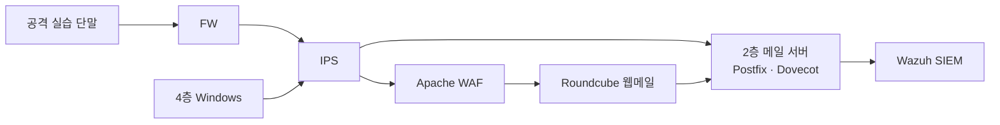

# 내부 도메인과 메일 실습

KT66은 배포별 내부 도메인 하나를 웹 서비스 이름, DNS, 웹 TLS 인증서, 메일 주소에 공통으로 사용합니다. 기본은 기존 주소와 호환되는 `kt66.lab`입니다. 새 환경은 `classroom.test`처럼 수업 전용 이름을 지정할 수 있습니다. 공개 DNS 등록이나 인터넷 메일 계정은 필요하지 않습니다.

## 처음 설치

`./kt66.sh install` 또는 최초 `./kt66.sh up`에서 서버 IP 다음에 내부 도메인과 Windows 설치 여부를 묻습니다.

```text
내부 실습 도메인 [기본 kt66.lab]: classroom.test
Windows 실습 PC도 설치할까요? (RAM 4 GiB · KVM 필요 · 공식 ISO 다운로드) [y/N]:
```

Windows 선택은 **기본 No**입니다. 비대화형 새 설치도 No이며, 선택은 `.env`의 `WINDOWS_ENABLED=yes/no`에 저장합니다. No이면 ISO를 다운로드하지 않고 Windows 서비스 2개도 시작하지 않습니다. 이미 설치된 Windows는 선택을 유지합니다. 메일·DNS·웹메일은 Windows와 별개로 설치됩니다.

나중에 Windows가 필요하면 기존 서비스를 다시 만들지 않고 다음 명령으로 추가합니다.

```bash
./kt66.sh windows
```

`/dev/kvm`, 실행 중인 FW·IPS가 필요합니다. 공식 ISO 다운로드, 검증, 사용자망 구성, Windows VM과 관리 콘솔 기동을 차례로 수행합니다. 성공한 ISO와 OS 디스크는 재사용합니다. [Windows 설치·중지·재시작](WINDOWS-ENDPOINT.ko.md)

자동 배포에서는 다음처럼 입력을 미리 지정할 수 있습니다.

```bash
LAB_DOMAIN=classroom.test WINDOWS_ENABLED=no ./kt66.sh up
```

IP는 실제 호스트에 존재하는 주소를 사용합니다. `0.0.0.0`은 서비스 바인딩 표기이므로 DNS에 넣을 수 없습니다.

## 접속과 계정

| 항목 | 기본 예시 |
|---|---|
| 웹메일 | `https://webmail.kt66.lab/` |
| DNS 설정 전 웹메일 | `http://<WEB_HOST_IP>:8091/` |
| 메일 서버 | `mail.kt66.lab` |
| 메일 보내기 | SMTP 587, STARTTLS, 로그인 필수 |
| 메일 읽기 | IMAPS 993, TLS |
| 내부 수신 실습 | SMTP 25, 실제 존재하는 내부 수신자만 허용 |
| 기본 계정 | `student@kt66.lab`, `instructor@kt66.lab`, `soc@kt66.lab` |

도메인을 바꾸면 표의 `kt66.lab`을 지정한 도메인으로 바꿉니다. 메일 비밀번호는 Windows 계정과 다르며 설치 시 계정마다 무작위로 생성합니다. 강사는 호스트에서 조회하여 수업 참여자에게 배부합니다.

```bash
python3 mail/manage.py show
python3 mail/manage.py list
# 새 계정 추가 또는 기존 계정 비밀번호 변경 (입력 내용은 화면에 표시되지 않음)
python3 mail/manage.py set-password student02
```

변경한 비밀번호는 초기 배부 파일에서 제거됩니다. 사서함과 웹메일 DB는 Docker 볼륨에 보존됩니다. 웹메일에서 편지를 작성하고 파일을 첨부하여 다른 실습 계정으로 보낼 수 있습니다. 인증서를 사용하는 클라이언트에서는 배포용 자체 서명 인증서를 신뢰하도록 등록합니다. TLS 인증서가 바뀌면 다시 등록해야 합니다.

## DNS와 주소 적용 범위

학생 PC의 DNS 서버를 **KT66 서버의 `WEB_HOST_IP`**로 설정합니다. 로컬 이름은 KT66 DNS가 응답하고 외부 이름은 상위 DNS로 전달합니다. DNS를 바꾸기 어려운 PC는 `deployment/runtime/hosts.txt` 내용을 hosts 파일에 추가할 수 있습니다. hosts 파일은 MX 레코드를 제공하지 않으므로 메일 클라이언트에는 서버 이름을 직접 지정합니다.

Windows VM은 실행 컨테이너의 DNS 프록시를 통해 내부 DNS를 사용합니다. 컨테이너·Windows에는 실제 DMZ 주소를, 강의실 PC에는 호스트 게시 주소를 응답합니다. 따라서 Windows가 강의실용 호스트 IP를 경유하다 사용자망 격리 정책에 막히는 문제가 없습니다.

설정은 다음에 적용됩니다.

- Apache의 모든 KT66 vhost, 웹메일 주소, 웹 인증서 SAN.
- SMTP 서버 이름·수신 도메인, IMAP 로그인 주소, 웹메일 기본 도메인.
- 내부 및 강의실 DNS의 A·MX 레코드, hosts 배부 파일.
- NOC 메일 자산의 접속 정보, 공통 메뉴와 랜딩 페이지 링크.
- 공격자·점프 호스트의 내부 DNS와 취약 웹앱 이름 매핑.
- 호스트의 관리되는 KT66 hosts 블록(`up` 시 적용).

기존 외부 서비스인 `cork.dawnofagi.cloud` 같은 주소와 NVIDIA 원격 관리 주소는 외부 자산의 실제 주소이므로 치환하지 않습니다. Wazuh 내부 인증서의 `wazuh.manager` 같은 Docker 서비스 식별자도 그대로 유지합니다. 실습 문서에 있는 `kt66.lab` 예시는 기본 도메인 표기입니다.

도메인을 바꾸려면 다음을 실행합니다.

```bash
./kt66.sh domain
./kt66.sh up
```

첫 명령은 새 값을 저장하고 설정을 생성하며, 두 번째 명령이 컨테이너 환경·DNS·vhost·메일에 적용합니다. 학생 PC의 DNS 캐시/hosts와 메일 클라이언트 로그인 주소도 갱신합니다. 메일 데이터는 계정 로컬 부분(`student`) 기준으로 보존하지만 기존 메시지의 주소, Roundcube의 이전 도메인 사용자 설정·연락처는 과거 기록 그대로 남습니다.

## 네트워크와 보안 관제



SMTP/IMAPS 게시 포트는 FW가 받아 IPS를 통해 DMZ 메일 서버로 전달합니다. 웹메일은 FW→IPS→WAF를 거칩니다. Windows에는 DNS `10.20.32.53:53`, 메일 `10.20.32.25:25/587/993`, 웹 진입 `10.20.32.80:80/443/8091`만 내부 접근 예외로 추가합니다. 다른 내부망·시설망 차단은 유지합니다.

SMTP 25는 외부 발신자 형식의 **실습 메시지를 내부 계정에 받는 것**을 허용합니다. SMTP 587은 인증을 요구합니다. 두 경로 모두 인터넷 수신자 릴레이를 거부하며, 인증 성공도 이를 해제하지 않습니다. SMTP 수신과 악성 파일 탐지는 별개입니다. 이 구성에는 안티바이러스, 첨부파일 샌드박스, SPF/DKIM/DMARC 종합 판정기가 포함되어 있지 않습니다.

Postfix·Dovecot 로그는 `10.20.32.100:514/udp`로 전송합니다. Wazuh 기본 디코더·규칙으로 다음을 확인할 수 있습니다.

| Wazuh 검색 | 의미 |
|---|---|
| `location: "10.20.32.25"` | 메일 서버에서 수신한 경보 |
| `rule.id: "3332"` | SMTP 인증 실패 |
| `rule.id: "3301"` | 외부 릴레이 시도 거부 |
| `rule.id: "3302"` | 수신자 거부 등 |
| `rule.id: "9701"` | IMAP 로그인 성공 |
| `rule.id: "9706"` | IMAP 세션 종료 |

모든 SMTP 로그 줄이 경보가 되는 것은 아닙니다. 전달 성공의 큐 ID·수신자·`status=sent` 원문은 `docker logs kt66-mail` 또는 컨테이너의 `/var/log/mail.log`에서 확인합니다. UDP syslog는 전송 보장을 제공하지 않으므로 원문과 SIEM 수신 기록을 구분합니다. 메일 본문 전체를 SIEM에 보내지 않습니다.

## 검증·파일 안내

```bash
python3 -m unittest discover -s deployment/tests -v
python3 mail/verify.py
dig @<WEB_HOST_IP> mail.kt66.lab
dig @<WEB_HOST_IP> kt66.lab MX
docker compose ps mail webmail lab-dns
docker logs --tail 30 kt66-mail
```

`verify.py`는 기본 초기 계정으로 무해한 첨부파일 한 건을 보내고 IMAP으로 수신합니다. 잘못된 인증, 없는 수신자, 인증 전후 외부 릴레이 거부도 검사합니다. 계정 비밀번호를 직접 바꿨다면 초기 계정 파일에 의존하는 검증기는 그대로 사용할 수 없습니다.

| 파일 | 역할 |
|---|---|
| `.env` | `LAB_DOMAIN`, `WINDOWS_ENABLED`, 서버 IP |
| `deployment/configure.py` | 입력 검증·DNS/주소 생성·초기 계정 생성 |
| `deployment/runtime/` | 배포별 DNS 설정·hosts 파일 (Git 제외) |
| `mail/start.py` | Postfix·Dovecot·TLS·로그 전달 설정 |
| `mail/accounts.json` | 비밀번호 해시 (Git 제외, 0600) |
| `mail/credentials.local.json` | 최초 계정 배부용 비밀번호 (Git 제외, 0600) |
| `mail/roundcube/kt66.php` | 한국어 웹메일·TLS 검증 설정 |
| `dns/start.sh` | 컨테이너용 53 / 강의실용 1053 DNS 리스너 |
| `web/configure-domain.py` | vhost 템플릿 → 현재 도메인 활성 설정 |
| `web/vhosts/130-mail.conf` | 웹메일 WAF 경로 |
| `endpoints/user-network.sh` | Windows 사용자망 접근 예외 |

구성 근거: [Postfix 릴레이 제어](https://www.postfix.org/SMTPD_ACCESS_README.html), [Dovecot SMTP 인증 연동](https://doc.dovecot.org/2.3/configuration_manual/howto/postfix_and_dovecot_sasl/), [공식 Roundcube 컨테이너](https://github.com/roundcube/roundcubemail-docker), [dnsmasq 설정](https://thekelleys.org.uk/dnsmasq/docs/dnsmasq-man.html).

웹 vhost 원본을 편집했을 때는 도메인 치환본을 다시 생성한 뒤 반영합니다.

```bash
docker exec kt66-web python3 /opt/kt66-configure-domain.py
docker exec kt66-web apache2ctl graceful
```

## 실제 배포 확인 (2026-10-05 KST)

- SMTP STARTTLS → 내부 사서함 → IMAPS에서 본문·첨부파일 수신 확인.
- 잘못된 비밀번호, 없는 수신자, 인증 전후 외부 릴레이 거부 확인.
- Roundcube의 실제 학생 로그인·수신함, NOC 2층 메일 자산 선택 확인.
- 실제 Windows 게스트에서 `webmail.kt66.lab`을 `10.20.32.80`으로 조회하고 HTTP 200 응답 확인.
- 공격 실습 단말에서 SMTP 수신 시 출발지 `10.20.30.202` 보존 확인.
- Wazuh에서 SMTP 인증 실패·릴레이 거부·IMAP 로그인 경보 수신 확인.
- 기존 웹앱 7종과 NOC·근무자 운영·웹메일의 이름 기반 경로 응답 확인.
- 배포 설정 테스트 8개, NOC 테스트 48개, 포털 자산 테스트 3개 통과. 별도 임시 도메인으로 모든 vhost와 TLS SAN 치환 확인.

기존 Windows 실행 컨테이너의 DNS를 실행 중에 바꿀 때는 VM 앞 DNS 프록시가 이전 상위 서버를 기억할 수 있습니다. 현재 배포에서는 프록시를 갱신하고 게스트 캐시를 비워 확인했습니다. 새 설치/재기동은 시작부터 내부 DNS를 읽습니다.
