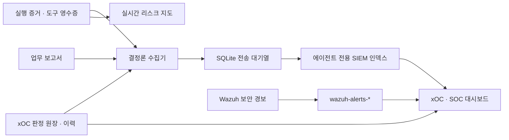

# 리스크 지도와 xOC·SOC 관제

[프로젝트 소개](../README.md) · [교수용 매뉴얼](INSTRUCTOR-GUIDE.ko.md) · [학생용 매뉴얼](STUDENT-GUIDE.ko.md) · [실행 증적](AGENT-CONTROL.ko.md)

관제의 목적은 **에이전트가 무엇을 시도했고, 어떤 권한으로 어디에 접근했으며, 결과를 믿을 수 있는지** 확인하는 것입니다. 시설 배치, 실시간 활동 위치, 경보·통계, 실행 증거는 서로 연결된 네 가지 보기입니다. 화면을 열거나 집계·재생하는 데 모델을 호출하지 않습니다.

## 화면을 고르는 방법

| 화면 | 주소 | 확인할 내용 |
|---|---|---|
| 데이터센터 전체 배치 | `:8020/` | 하드웨어·시설·조직과 근무석 |
| 리스크·권한 관제 탭 | `:8020/?view=risk` | 12개 논리 구역, 실제 기록에 따른 에이전트 이동, 권한 경계·승인 대기, 기록 재생 |
| xOC AI 에이전트 관제 | `:8050/xoc` | 현재 미종결, 반복 경보 묶음, 도구·거절·토큰 통계, 판정·보류 |
| SOC 보안 관제 | `:8050/soc` 또는 xOC 안의 SOC 탭 | Wazuh 경보 수준·시간대·출발지·규칙 분포, 원본 증거 |
| 사건·보고서함 | xOC의 세 번째 탭 | 탐지 사건 상태별 검색, 모든 팀의 업무 보고서, 페이지 이동 |
| 에이전트 실행 증적 | `:8020/agent-control` | 한 실행의 요청·계획·도구·권한·결과를 조사 |

강사 키는 인증 헤더로만 보내며 이 화면의 메모리에 보관합니다. 잠그면 자료와 키를 비우고 진행 중 조회를 취소합니다. 운영 증적 API는 인증 없이 열리지 않으며 캐시하지 않습니다. 공용 강사 키이므로 개인별 로그인·감사인 IAM을 구현한 것은 아닙니다.

## 리스크 공간을 읽는 방법

구역은 물리 네트워크나 실제 방이 아닌 **활동의 평가축**입니다. 에이전트가 도구를 호출하면 영수증의 주 평가축으로 이동합니다. 부 평가축은 상세에 함께 표시합니다. 임의의 순찰·가짜 작업 애니메이션을 생성하지 않습니다.

| ID | 구역 | 핵심 질문 |
|---|---|---|
| Z01 | 업무·트리거 | 누가 어떤 이유로 시작했는가? |
| Z02 | 자산·영향 범위 | 어느 자산에 영향을 주는가? |
| Z03 | 신원·인증 | 어떤 신원·하네스인가? |
| Z04 | 직무·권한 경계 | 역할·대상 범위를 넘었는가? |
| Z05 | 승인·변경 통제 | 이 변경에 유효한 승인이 있는가? |
| Z06 | 데이터·기밀성 | 필요한 데이터만 접근·전달하는가? |
| Z07 | 외부 지식·스킬 | 지식의 출처·변경이 검증됐는가? |
| Z08 | 판단·결과 품질 | 주장과 실제 근거가 일치하는가? |
| Z09 | 도구·실행 격리 | 허용된 도구·공간 안에서 실행하는가? |
| Z10 | 협업·위임 | 위임으로 권한이 넓어지는가? |
| Z11 | 자원·비용·복구 | 예산·재시도·복구 조건을 지키는가? |
| Z12 | 관제·감사 | 독립적으로 누가 무엇을 검토했는가? |

발밑의 **E1 기본 조회·기록 / E2 민감 조회·산출물 / E3 상태·구성 변경 / E4 승인·실행 통제**는 활동의 노출 등급입니다. E4가 곧 침해라는 뜻은 아닙니다. 미등록 도구는 등급 미확인으로 남기고, xOC 사건의 가능성×영향 점수와 구별합니다.

- 접근 거절은 Z04의 **바깥 경계**에, 승인 대기는 Z05 게이트에 멈춥니다. 시도한 대상 구역과 실제 판정 구역을 함께 표시합니다.
- 보류된 에이전트는 별도 보류 공간, 활동이 없는 근무자는 대기 공간에 둡니다. 현재 작업에 새 도구 기록이 없으면 과거 작업의 위치를 현재 위치로 쓰지 않습니다.
- 현재 직무의 도구가 관련된 구역을 점선으로 보여줍니다. 자산 조건·승인·시점별 정책을 모두 만족했다는 허가 표시는 아닙니다.
- 첫 조회는 관측 위치를 표시합니다. 새 기록은 경로를 따라 이동하고 과거 기록은 **기록 재생**을 눌러 별도로 봅니다. 이동 경로·속도 자체는 화면 표현입니다.
- 지도는 5초마다 조회하며 실행 인덱스에는 최대 10초 캐시가 있습니다. 최근 24시간의 최대 120개 실행·480개 이벤트, 미종결 xOC 최대 200개를 투영합니다. 범위·잘림·수집 공백을 하단에 표시합니다.
- 수집 지연 시 이동을 멈추고 마지막 관측 시각을 표시합니다. 재생 중에는 과거 활동과 **현재 xOC 판정**을 명확히 구분합니다.

공간 설정은 [risk-zones.yaml](../agents/xoc/risk-zones.yaml)입니다. 학생은 `tools.<도구>.primary`, `axes`, `exposure`를 바꾸고 새로고침해 표현 변화를 비교할 수 있습니다. **이 파일은 권한을 부여하지 않습니다.** 직무·도구 경계는 `harness.yaml`, 실제 탐지는 `xoc/rules.yaml`이 담당합니다. 이미 SIEM에 저장한 문서의 분류는 새 설정으로 자동 소급 변경하지 않습니다.

## 대시보드와 사건 정리

AI 관제의 우선순위 화면은 현재 미종결을 **담당자 × 규칙**으로 묶어 위험도와 최근 시각 순으로 최대 8묶음을 표시합니다. 한 묶음이 여러 사건을 포함해도 원장과 증거는 각각 보존합니다. 대표 사건을 종결한다고 묶음 전체가 종결되지 않습니다. 오탐·종결은 사건함에서 상태 필터로 다시 찾습니다.

SOC는 `wazuh-alerts-*`의 실제 집계를 읽습니다. 수준 12 이상을 우선 조사 대상으로 삼아 규칙별 반복을 묶고 대표 경보를 보여줍니다. 이 기준은 교육용 우선순위이며 실제 침해 판정은 아닙니다. IP 수는 `data.srcip`가 있는 경보만의 고유값 추정치, 자산 수는 `agent.id` 기준입니다. 주소가 없는 경보를 임의 IP로 채우지 않습니다.

분석 기간은 1시간·24시간·7일·30일입니다. **현재 미종결·실행 보류는 기간과 무관한 원장 전체**, SIEM 경보·도구·토큰·추세는 선택 기간입니다. 세션 결과와 토큰은 실행 시작 시각에 집계하며 `result.json`과 `session-result.json`을 중복 합산하지 않습니다. 토큰 미측정을 0원·무료로 표현하지 않습니다.

업무 보고서는 자연어 산출물입니다. 기존 Markdown에 표준 처리 상태가 없으면 **참고 기록**으로 분류하고 미종결 경보 수에서 제외합니다. 제목·담당자 검색, 영역 필터, 25개씩 페이지 이동으로 찾습니다. Markdown은 안전하게 렌더링하고 보고서를 여는 것만으로 외부 이미지를 요청하지 않습니다. 연결된 실행 증거로 이동해 주장과 관측을 대조합니다.

대시보드는 30초마다 갱신하고 서버 집계는 15초 캐시합니다. 지도·판정 원장은 로컬 증적을 읽고, 장기 이벤트·보고서·SOC 통계는 SIEM을 읽습니다. 수집기 지연·과거 적재·검색 실패는 0건 정상과 구별하여 표시합니다.

## SIEM 저장 구조와 계정

**v2 정밀 관제**의 컬럼·원본 대응, Wazuh 화면 설정, 저장 검색/대시보드 가져오기와 사건 조사 절차는 [Wazuh 에이전트 관제 매뉴얼](WAZUH-AGENT-MONITORING.ko.md)에 있습니다. 기존 필드는 유지하면서 요청/작업/실행/호출 연결, 자원·승인 nested 객체, 설정 버전, 토큰 분리, 계측 누락 필드를 추가했습니다. 기존 인덱스에도 매핑을 추가하고 원본을 같은 ID로 재적재합니다.



| 인덱스 | 내용 | 문서 식별 |
|---|---|---|
| `kt66-agent-events-YYYY.MM.DD` | 실행·자기 보고·도구·결과·판정/보류 이력·요청/승인 상태·승인/회수 이력 | 원본 경로·기록 ID에서 만든 안정적 ID, UTC 날짜 |
| `kt66-agent-findings-v1` | xOC 발견과 현재 판정 상태 | 발견 ID, 판정 변경 시 동일 문서 갱신 |
| `kt66-agent-tickets-v1` | 팀별 업무 보고서, 마스킹한 본문·출처 | 원본 경로의 안정적 ID |
| `wazuh-alerts-*` | 기존 인프라 보안 경보 | 기존 Wazuh 수집 유지 |

`schema_version`, `worker`, `role`, `run_id`, `kind`, `outcome`, `assertion`, `zone`, `axes`, `permission_mode`, `targets`, `evidence_ref`, `evidence_sha256` 등으로 연결합니다. 비밀값은 마스킹하고 원문 프롬프트·전체 도구 결과·비공개 내부 추론은 복제하지 않습니다. 도구 영수증은 브로커 관측, 활동 요약과 보고서는 자기 보고, 종료·사용량은 실행기 기록으로 구분합니다. 상세 원문은 기존 실행 증적에 있습니다. 파일/JSONL 해시는 원문 바이트, xOC 상태의 해시는 해당 객체의 정규화한 JSON 기준입니다.

전송 대기열과 파일 커서는 동일 SQLite 트랜잭션에 저장합니다. SIEM의 문서별 성공 응답 후에만 대기열에서 제거합니다. 일부 실패·재시작·응답 유실은 같은 ID로 재전송합니다. 쓰기 중인 마지막 줄은 다음 주기에 읽고 손상된 JSONL은 커서를 멈춰 수집 오류로 남깁니다. 원본 파일을 고치거나 삭제하지 않습니다. 초기에는 오래된 증거를 차례로 적재하며, 대기열이 커지면 새 스캔을 제한하고 전송을 우선합니다.

| 서비스 | 권한과 저장소 |
|---|---|
| `agent-observer-setup` | 일회성 초기화. 관리자 TLS 인증서로 **KT66 전용** 템플릿·역할·계정만 준비하고 종료 |
| `agent-observer` | 에이전트 증적 읽기 전용, 전용 인덱스 생성/문서 기록. SOC 조회·문서 삭제·관리 API 권한 없음. Docker 소켓·모델 인증 없음 |
| `agentops` | 별도 조회 계정으로 전용 인덱스·Wazuh 검색. SIEM 문서 쓰기·계정 관리 권한 없음. 기존 xOC 조치는 인증된 로컬 원장 API 사용 |

계정 비밀번호는 초기화 때 무작위로 만들고 writer/reader **별도 Docker 볼륨**에 보관합니다. 인증서 체인·호스트명을 검증합니다. `verify=false` 또는 관리자 계정을 상주 웹/수집기에 사용하는 방식은 쓰지 않습니다. 초기화 컨테이너의 `Exited (0)`는 정상입니다.

## 설치와 운영 확인

새 설치는 기존 `sudo ./kt66.sh up`에 포함됩니다. 기존 서버에는 다음 순서로 추가합니다. 아래 명령은 실행기나 모델 세션을 시작하지 않습니다.

```bash
docker compose -f docker-compose.yaml up -d --build --no-deps agent-observer-setup
docker compose -f docker-compose.yaml logs --tail=30 agent-observer-setup
# '준비 완료'와 Exited (0)를 확인한 뒤
docker compose -f docker-compose.yaml up -d --build --no-deps agent-observer agentops noc
```

교수는 대시보드의 수집 상태에서 전송 대기·문서 오류·원본 수집 오류·최근 검사 시각을 먼저 확인합니다. 과거 적재 중인 통계를 완전한 전체 집계로 사용하지 않습니다. SIEM 장애 시 전송 대기열이 보존되므로 인덱스나 볼륨을 지워서 복구하지 않습니다. Wazuh의 인덱스 패턴 관리에서 전용 패턴과 `@timestamp`를 선택하면 SIEM에서도 검색할 수 있습니다.

자동 만료·삭제 정책은 설정하지 않았습니다. 수업의 보존 기간·디스크 용량·백업 기준을 정한 뒤 관리자가 에이전트 인덱스에 별도 보존 정책을 적용합니다. 원본 증적, `agent-observer-state` 전송 상태, SIEM 데이터, 각 계정 볼륨을 함께 백업해야 복구 시 중복·공백을 판단할 수 있습니다. 이 구성은 원격 불변 저장소나 WORM·서명 감사 체계를 제공하지 않습니다.

## Luvus의 적용 범위

[Luvus](https://github.com/RizRiyz/luvus)는 코딩 에이전트 세션·터미널·작업 상태와 이벤트를 모으는 보조 운영 도구로 검토했습니다. 현재 구현은 Luvus를 설치하거나 러너를 교체하지 않습니다. 이 시스템에서는 **직무 정책 브로커의 영수증과 탐지 원장**이 보안 판정의 근거이기 때문입니다.

추가 연동 시에는 [공식 에이전트 가이드](https://luvus.dev/docs/guides/agents/)의 세션 이벤트를 어댑터로 수집하여 `run_id`와 연결하는 방식이 적합합니다. 터미널의 working/done은 런타임 관측으로 표시하고, 도구 허가·변경 승인·사건 종결의 근거로 승격하지 않습니다. KT66 역할을 우회하는 별도 실행·메시지·세션 재개 권한도 자동으로 제공하지 않아야 합니다. 모델 실행 비용은 계속 기존 실행기·CLI 계측을 기준으로 비교합니다.

OpenSearch 연동은 공식 [Bulk API](https://docs.opensearch.org/latest/api-reference/document-apis/bulk/)와 [보안 권한 API](https://docs.opensearch.org/latest/security/access-control/api/)를 사용합니다.

## 학생 실습

1. 시스템 담당에게 디스크 조회를 요청하고 Z02의 조회·영수증을 확인합니다. 네트워크 담당에게 같은 질문을 했을 때 역할 안내나 위임과 실제 접근 시도를 구분합니다. 거절 영수증이 없는 상황을 가짜 침입 이동으로 만들지 않습니다.
2. 정상·실패·승인 대기 기록을 재생하고 시도 구역, 실제 판정, 적용된 권한을 설명합니다.
3. 같은 규칙의 반복 경보를 골라 묶음 건수와 개별 사건 수를 비교합니다. 한 사건에 오탐 근거를 작성하고 다른 사건이 유지되는지 확인합니다.
4. SOC의 시간대를 바꾸어 경보 수준·출발지·규칙 분포를 비교하고, 주소 없는 로그 때문에 생기는 관측 한계를 적습니다.
5. 전문가의 절차를 스킬로 바꾼 전후에 결과 품질·도구 수·측정 토큰·오류·미수집을 함께 비교합니다. “경보가 줄었다”만으로 더 안전해졌다고 결론내리지 않습니다.
