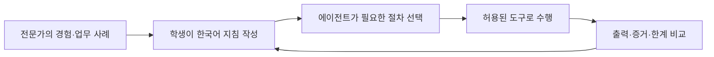

# KT66 학생용 매뉴얼

[프로젝트 안내](../README.md) · [교수·강사용 매뉴얼](INSTRUCTOR-GUIDE.ko.md) · [업무 요청 상세](USER-REQUESTS.ko.md)

KT66에서는 데이터센터 근무자에게 자연어로 일을 요청하고, 그 근무자가 참고하는 지침을 바꿔 업무 방식의 변화를 관찰합니다. **전문가가 무엇을 확인하고 어떤 근거로 판단하는지를 배우고, 이를 에이전트가 수행할 수 있는 절차로 표현하는 것**이 목표입니다.

바로 찾기: [화면 사용](#student-start) · [어느 파일을 고칠까](#agent-files) · [SOC 기본값](#soc-defaults) · [작성법](#agent-writing) · [첫 비교 실습](#agent-lab) · [Claude/Codex 공유](#shared-runtime) · [제출물](#submission)

<a id="student-start"></a>

## 1. 실습 시작 전

강사에게 서버 주소, 담당 역할, 실습 범위와 편집 가능한 파일을 받습니다. 서버가 이미 준비되어 있다면 학생이 설치 절차를 반복할 필요는 없습니다.

1. `http://<관리 IP>:8020/`의 데이터센터 관제에 접속합니다.
2. 층·존·자산과 현재 경보를 확인합니다. **층은 배치, 존은 네트워크 구획**입니다.
3. 맡은 근무자의 역할과 담당 자산을 읽습니다.
4. 대화·지침 저장 등 제어 작업에는 수업에서 지정한 강사 키를 사용합니다. 키를 제출 문서에 적지 않습니다.
5. 같은 환경을 여러 명이 사용하면 지침과 실제 장애 상태가 함께 바뀌므로 편집·주입 순서를 맞춥니다.

시설 수치에는 시뮬레이션·환산값이 포함됩니다. 실제 서버·로그 관측과 구분합니다. 근무자 발밑 원의 상태는 실행기의 관측값이며, 회색 대기 상태 자체가 고장은 아닙니다. 상태 범례는 [관제 안내](AGENT-CONTROL.ko.md#배치도의-발밑-상태-원)를 참고합니다.

### 화면별 첫 실습

| 화면 | 진행 순서 | 남길 증거 |
|---|---|---|
| 데이터센터 관제 | 자산·설비의 정상 상태 확인 → 강사가 준비한 이상 관찰 → 복구 후 비교 | 시각·자산·경보·영향 범위 |
| Wazuh·보안 GUI | 같은 대상·시간의 경보와 보안장비 관측 비교 | 원문·규칙·차단 여부와 판단 한계 |
| 모델 운영 `:8060` | 지표·티켓 읽기 → 새 버전의 설정·지식 수정 → 평가·배포 → 같은 기간 지표 비교 | 버전·변경 이유·평가 결과·운영 지표 |
| 인프라 요구사항 `:8070` | 요구서·수용 기준 읽기 → 허용된 실습 변경 → 실제 상태 검사 | 통과·미통과 항목과 원인 |
| 근무자 운영·업무 요청 `:8050` | 기본 업무 실행 → 지침 한 가지 수정 → 같은 입력으로 재실행 | 지침 차이·요청 ID·도구·결과 |

모델 운영 화면의 모델 설정은 데이터센터 서비스의 응답 방식을 바꿉니다. 근무자 에이전트의 모델·역할 설정과는 다릅니다. 모의 백엔드인지 실제 Ollama 응답인지 확인하고 결과를 해석합니다. 장애 주입과 운영 변경은 강사가 지정한 과제·대상에서 수행합니다.

## 2. 질문·업무 요청·결과 확인

### 담당자에게 질문하기

캐릭터의 **말 걸기** 또는 `:8050/requests`의 **근무자 대화**에서 시작합니다. 대화는 조회·설명에 사용합니다.

| 질문 예 | 담당자 | 답변에서 확인할 것 |
|---|---|---|
| 현재 디스크가 80% 이상인 시스템을 확인해 줘 | 시스템/스토리지 | 실제 사용률, 측정 시각, 미측정 대상 |
| 최근 1시간 시스템이 이상해. 관련 경보를 봐 줘 | SOC | 조회 기간, 관련 경보, 판단·보류 근거 |
| 보안장비의 IP와 대장에 적힌 값을 비교해 줘 | 네트워크 | 해당 담당 자산의 설정·실제 관측 차이 |
| 냉방 경보가 생긴 설비와 관련 상태를 확인해 줘 | 시설 | 시뮬레이션 상태·경보·확인하지 못한 영향 |

네트워크 담당에게 디스크를 물어봤을 때 시스템 담당자를 안내하는 것은 **직무 분리의 정상 동작**입니다. 역할 밖 도구는 “항상 허용”으로도 열리지 않습니다. 역할 안에서 승인이 필요한 조회에는 **이번만 허용 / 항상 허용 / 요청 보류**가 표시됩니다.

한 메시지마다 하나의 구독 세션을 사용합니다. 화면만 열어 두거나 결과를 새로고침하는 것으로 모델을 호출하지 않습니다. “최근 1시간”은 메시지 접수 시점을 기준으로 해석하므로 정확한 전후 비교에는 고정된 시작·종료 시각을 적습니다.

### 여러 단계의 작업 요청하기

홈페이지 제작·변경안 준비·여러 담당자의 협업은 **업무 요청**으로 접수합니다. 원하는 결과, 대상, 조건, 완료 기준과 허용 범위를 적습니다.

> 우리 회사의 AI 제품 소개용 정적 홈페이지를 만들어 줘. 제품·가격·문의 안내를 넣고 모바일에서도 읽기 쉽게 해 줘. 결제와 로그인 기능은 제외하고, 검사 결과와 배포할 변경안을 보여 줘.

계획, 담당 작업, 산출물과 검토 결과를 확인합니다. 변경안 준비와 실제 배포는 다른 상태입니다. 홈페이지·WAF 변경은 수업에서 정한 검토와 적용 승인 절차를 따릅니다. 현재 홈페이지 기능은 정적 HTML/CSS/JavaScript 범위이며 상세 지원 범위는 [업무 요청 안내](USER-REQUESTS.ko.md)에 있습니다.

### “무엇을 했나” 확인하기

답변의 조회 기록과 **4층 → AI 에이전트 관제**를 함께 봅니다. 요청·트리거 → 상황·계획 → 도구 입력·결과 → 검토·결과 순서로 읽습니다. 도구 실패, 조회 범위 잘림, 미수집 자료도 확인합니다.

`completed`는 한 회차의 종료 상태입니다. 실제로 문제가 해결됐는지는 도구 결과와 사후 확인으로 판단합니다. 모델이 설명한 판단 요약은 확인 가능한 원본 증거와 구분하고, 토큰 수는 계정의 잔여 구독량으로 해석하지 않습니다.

<a id="agent-learning"></a>

## 3. 전문가의 일하는 방식을 지침으로 작성하기

이 시스템의 교육 목표는 **전문가가 무엇을 보고, 어떤 순서로 판단하고, 누구에게 일을
넘기며, 무엇을 확인한 뒤 완료하는지를 학생이 자연어로 표현하고 실행 결과로 검증하는 것**이다.
학생은 현장에서 접하기 어려운 데이터센터·보안 운영 업무를 에이전트의 업무 흐름으로
읽고, 세부 지침을 바꾸고, 에이전트의 출력과 실제 도구 사용이 어떻게 달라지는지 관찰한다.

처음에는 저장소에 포함된 **기본 업무 지침**으로 시작한다. 수업이 진행되면 학생이
담당 역할의 조사 순서·판단 근거·보고 방식·협업 조건을 구체화한다. 강사는 전문 업무의
사례와 기준을 제공하고, 학생은 그 기준을 실행 가능한 업무 절차로 옮긴다. 학생은 이 과정에서
에이전트에 전달할 **지침·자료·도구·권한을 구성하는 방법**을 배운다.



학습 결과는 보고서의 표현뿐 아니라 **조회 범위, 사용한 증거, 판단의 변화, 미확인 사항,
권한 준수, 후속 작업, 비용**으로 평가한다. 결과가 더 길거나 더 자신 있게 쓰였다고
업무가 개선된 것은 아니다. 작은 수정의 효과를 바로 비교하는 실습부터 시작한다.

바로 찾아가기: [어느 파일에 쓸까](#agent-files) · [SOC 기본값](#soc-defaults) ·
[작성 예시](#agent-writing) · [월간 분석·규칙 관리](#soc-extensions) ·
[수정 전후 비교 실습](#agent-lab) · [현재 기능 범위](#agent-limits)

<a id="agent-files"></a>

### 어떤 내용을 어느 파일에 쓰나

**일하는 방법은 스킬, 실행 시간은 루프, 요청별 업무 선택은 persona**에 쓴다.
처음에는 아래 표에서 바꾸려는 내용에 해당하는 파일 하나만 연다. 예시 경로는 저장소 루트 기준이다.

| 학생이 바꾸고 싶은 내용 | 저장할 곳 | SOC 예시 |
|---|---|---|
| “오늘 경보에서 무엇을 보여줄까?”, “신규 IP는 어떻게 조회할까?” | 조회 스킬 | [siem-period-analysis/SKILL.md](../agents/native/.agents/skills/siem-period-analysis/SKILL.md) |
| “이상 징후가 생기면 무엇부터 확인할까?”, “언제 보류할까?” | 사건 조사 스킬 | [soc-incident-investigation/SKILL.md](../agents/native/.agents/skills/soc-incident-investigation/SKILL.md) |
| “30개 지표를 어떻게 해석하고 고위험 대상을 조사·보고할까?” | 종합 분석 스킬 | [ip-risk-investigation/SKILL.md](../agents/native/.agents/skills/ip-risk-investigation/SKILL.md) |
| “단순 질문·사건 조사·종합 분석 중 어느 절차를 선택할까?” | 역할 안내 | [personas/soc-analyst.md](../agents/personas/soc-analyst.md) |
| “평시에는 언제 점검하고 특이사항에 어떻게 반응할까?” | 평시 루프 | [loops/siem-alert-triage.yaml](../agents/loops/siem-alert-triage.yaml) |
| “종합 분석을 하루 한 번 할까, 두 번 할까? 몇 시에?” | 종합 분석 루프 | [loops/soc-daily-risk-review.yaml](../agents/loops/soc-daily-risk-review.yaml) |
| “담당자·모델·실행할 루프를 연결하려면?” | 근무자 명단 | [roster.yaml](../agents/roster.yaml)의 `soc-analyst` 항목 |
| “실제로 어떤 도구·자산에 접근할 수 있나?” | 서버의 직무 정책 | [harness.yaml](../agents/harness.yaml)의 `security.roles`와 권한 설정 |

예를 들어 “고위험 IP가 일으킨 이벤트를 확인하고 원본 근거를 보고해라”는 **스킬**에,
“그 업무는 매월 1일에 해라”는 **루프**에 쓴다. “월간 분석 요청에는 해당 스킬을 사용해라”는
**persona**에 쓴다. 블랙리스트의 개별 IP나 매일 바뀌는 취약점 목록은 지침이 아니라
**조회할 업무 데이터**이며, 항목마다 스킬을 새로 만들지 않는다.

<details>
<summary>파일 구조 전체 보기 — 처음에는 SOC 스킬 세 개만 읽어도 된다</summary>

```text
agents/
├── personas/soc-analyst.md                 # 역할과 필요한 스킬을 고르는 기준
├── native/
│   ├── AGENTS.md                          # 사용자 업무의 공통 지침
│   ├── .claude/agents/kt66-request-worker.md # 사용자 업무 담당자의 공통 역할
│   └── .agents/skills/
│       ├── siem-period-analysis/SKILL.md    # 요청한 범위의 조회
│       ├── soc-incident-investigation/SKILL.md # 특정 사건 조사
│       └── ip-risk-investigation/SKILL.md  # 종합 위험 분석
├── loops/
│   ├── siem-alert-triage.yaml              # 평시 점검·특이사항
│   └── soc-daily-risk-review.yaml          # 하루 두 번 종합 보고
├── roster.yaml                            # 담당자·모델·루프 연결
├── harness.yaml                           # 실제 권한·예산·시간대
├── examples/soc/                          # 기본 제공 확장 예시, 자동 실행 안 됨
│   ├── skills/soc-monthly-review/SKILL.md
│   ├── skills/security-rule-lifecycle/SKILL.md
│   └── loops/                             # 월간·일일 위협 검토 시간표 예시
├── runtimes/                              # 자동 생성된 실행 사본: 직접 수정 안 함
└── evidence/                              # 회차별 입력·도구 기록·결과
```

`agents/native/AGENTS.md`는 **사용자 업무의 공통 지침**이다. SOC만의 분석 방법은 SOC
스킬에 쓴다. 실제 실행용 `CLAUDE.md`, `AGENTS.md`, 역할 파일과 스킬 사본은 실행기가
생성한다. 런타임별 생성 파일을 각각 수정하지 않는다. 표준 파일명은 `CLAUDE.md`와
`AGENTS.md`이며, 스킬의 파일명은 대소문자를 유지한 `SKILL.md`다.

</details>

<a id="soc-defaults"></a>

### 설치 직후의 SOC 기본값

아래 설정은 이미 활성 기본값으로 저장되어 있다. 학생은 빈 파일에서 시작할 필요 없이
현재 파일을 읽고 한 가지씩 바꿀 수 있다.

| 상황 | 기본 행동 | 읽는 상세 스킬 |
|---|---|---|
| 평시 | 기본 10분 간격 코드 점검. 변화가 없으면 모델 호출 없음 | 없음 |
| “오늘 경보 목록”, “지난 한 달에 없던 신규 IP 수” | 요청 기간·조건만 조회하고 자료 한계와 함께 답변 | `siem-period-analysis` |
| 새 공격 징후·특정 자산 이상 | 관련 사건의 범위를 좁혀 조사 | `soc-incident-investigation` |
| 매일 09:00·18:00 KST 또는 명시적인 종합 분석 요청 | IP별 지표·위험 평가·고위험 후보 조사·보고 절차 적용 | `ip-risk-investigation` |
| 인사·역할 설명·기존 결과 설명 | 필요한 설명만 답변 | 불필요한 스킬 조회 생략 |

**persona 전문과 스킬 목록·설명은 초기 컨텍스트에 들어간다. 상세 `SKILL.md` 본문은
선택한 스킬을 `skill_read`로 읽을 때 들어간다.** 같은 세션에서 같은 내용을 반복해서
읽지 않도록 지시한다. 문서를 길게 써 두었다고 모든 질문에 그 본문이 자동 삽입되지는 않는다.
실제로 무엇을 읽었는지는 도구 기록으로 확인한다. 선택 기준도 지침이므로 결과를 검토하며 개선한다.

평시 점검은 문제·변화가 이어지면 10→5→2→1분으로 짧아지고, 안정되면 돌아간다.
종합 분석 예약은 평시 점검과 별도다. 시각은 `agents/harness.yaml`의
`execution.timezone: Asia/Seoul`을 기준으로 한다.

<a id="agent-writing"></a>

### 자연어 지침을 작성하는 법

“잘 분석해라” 대신 **언제, 어떤 자료로, 어떤 순서로, 무엇을 확인하고, 무엇을 남길지**를 쓴다.
학생은 아래 질문에 답하면서 전문가의 판단 과정을 업무 절차로 구체화할 수 있다.

| 작성 항목 | 스스로 물어볼 질문 | 예시 문장 |
|---|---|---|
| 적용 상황 | 언제 이 절차가 필요한가? | 새 공격 징후나 기존 사건에 추가 증거가 생겼을 때 적용한다. |
| 범위와 입력 | 어느 기간·대상·자료를 확인하는가? | 요청한 시간대의 관련 IP·자산·이벤트를 확인하고 누락 범위를 적는다. |
| 작업 순서 | 무엇을 먼저 하고 다음에 무엇을 확인하는가? | 이전 사건과 비교한 뒤 새 증거에 해당하는 원문을 조회한다. |
| 판단 기준 | 결론을 바꾸는 증거는 무엇인가? | 정상 업데이트로 보이면 실제 변경 기록을 확인한 뒤 정상 여부를 판정한다. |
| 한계·예외 | 자료가 없거나 반대 증거가 있으면 어떻게 하는가? | 변경 기록이 없으면 판단을 보류하고 필요한 자료를 명시한다. |
| 협업 | 누가 어떤 자료·조치를 맡는가? | 호스트 확인은 시스템 담당에게 보낼 기간·대상·증거 요청안으로 정리한다. |
| 결과와 완료 | 무엇을 남겨야 업무가 끝나는가? | 관찰 사실·판정·근거·미확인 사항·다음 작업을 구분해 보고한다. |

다음은 **기존 사건 조사 스킬을 읽는 방법을 보여 주는 축약 예시**다. 실제 기본 파일에는
조회 범위·권한·재작업·비용 등에 관한 상세 내용이 있다. 축약본으로 기존 파일 전체를 덮어쓰지 않는다.

```markdown
---
name: soc-incident-investigation
description: 새 공격 징후나 특정 IP·자산 이상을 조사하고 증거와 후속 작업을 기록한다.
---

# 사건 조사

## 적용 상황
새 증거가 생긴 사건을 조사한다. 단순 경보 목록 질문에는 적용하지 않는다.

## 작업 순서
1. 이전 기록과 비교해 새로 발생한 일을 특정한다.
2. 공격 가능성과 정상 업무 가능성을 구별할 증거를 확인한다.
3. 확인한 사실과 아직 확인하지 못한 부분을 구분한다.
4. 추가 증거가 필요하면 대상·기간·필요 자료·담당자를 적는다.

## 판정 기준
정상 변경처럼 보이더라도 변경 기록을 확인하지 못하면 보류한다.
차단 로그만으로 침해가 없었다고 단정하지 않는다.

## 결과
관찰 사실 / 판정 / 근거 / 미확인 사항 / 다음 작업을 보고한다.
```

`name`은 파일이 들어 있는 폴더명과 같게 유지한다. `description`에는 **언제 선택할지**를,
본문에는 **선택한 뒤 어떻게 일할지**를 쓴다. 학생이 주로 수정하는 곳은 한국어 본문이다.
규칙·사례를 추가할 때 기존 지침과 충돌하는 문장을 함께 정리한다.

persona의 머리말에는 사용할 스킬을 연결한다. 현재 기본값은 다음과 같다.

```yaml
---
description: "4F SOC 분석가. 조회, 특이 사건 조사, 정기 종합 분석을 담당한다."
skills: [siem-period-analysis, soc-incident-investigation, ip-risk-investigation]
---
```

스킬 파일을 만들기만 하면 이 역할에 자동 배정되는 것은 아니다. 역할의 `skills`에
연결하고, 본문에 어떤 상황에서 선택할지 적는다. 실제 모델은 `roster.yaml`, 실행 권한은
`harness.yaml`과 서버 코드가 결정한다. persona에 가상의 도구 이름을 써서 기능을 만들 수는 없다.

실행 시간은 루프의 `cadence`만 바꾸면 된다. 예를 들어 기본 하루 두 번을 한 번으로 바꾸려면
[종합 분석 루프](../agents/loops/soc-daily-risk-review.yaml)의 해당 항목을 수정한다.

```yaml
# 기본값: 매일 09시와 18시
cadence: "0 9,18 * * *"
# 한 번으로 바꿀 때의 대체 값: 매일 09시
# cadence: "0 9 * * *"
```

`steps`는 해야 할 일, `gates`는 판정 전에 확인할 조건을 모델에게 전달하는 지침이다.
이 항목에 적었다고 모든 단계를 코드가 강제 검증하는 것은 아니다. 실제 조회·권한·예산·
승인·변경 실행은 구현된 도구와 실행기가 검사한다.

<a id="soc-extensions"></a>

### 전문가 SOC 업무의 확장 예시: 월간 분석과 규칙 관리

사용자가 설명한 전문 업무를 학생용 기본 예시로 제공한다. **현재 실행되는 기본값은
위의 조회·사건 조사·하루 두 번 종합 보고다.** 아래 파일은 `agents/examples/soc/`에
포함되어 있으며 자동 실행 명단에 연결하지 않았다. 파일을 읽고 수정하는 것만으로
새 모델 세션이나 보안장비 변경이 발생하지 않는다.

| 전문가의 업무 | 기본 예시 파일 | 기본 예시의 내용 |
|---|---|---|
| 한 달 데이터를 종합해 위험 이벤트·시간대 찾기 | [soc-monthly-review/SKILL.md](../agents/examples/soc/skills/soc-monthly-review/SKILL.md) | 고위험 IP 관련 이벤트, 위험 시간대의 반복 이벤트, 국내 전용 서비스의 해외 접근, 블랙리스트 IP의 공격 패턴 |
| 월간 분석의 실행 시간 | [soc-monthly-risk-review.yaml](../agents/examples/soc/loops/soc-monthly-risk-review.yaml) | 매월 1일 10시, 지난 달 분석 |
| 신규 취약점·공격기법 및 관제 패턴을 규칙으로 연결하기 | [security-rule-lifecycle/SKILL.md](../agents/examples/soc/skills/security-rule-lifecycle/SKILL.md) | 적용성 확인 → 변경안 → 양성/음성 시험 → 검토·승인 → 등록 → 사후 검증·복구 |
| 매일 신규 위협을 검토할 시간 | [soc-daily-threat-review.yaml](../agents/examples/soc/loops/soc-daily-threat-review.yaml) | 매일 09:30, 관련 위협만 검토하고 필요한 변경안 작성 |

이 예시에서 스킬은 **업무 종류별**로 만든다. 신규 취약점 하나, 블랙리스트 IP 하나,
탐지 규칙 하나마다 `SKILL.md`를 추가하지 않는다. 월간 분석에서 발견한 패턴과 매일의
신규 위협은 동일한 규칙 관리 절차로 들어오는 서로 다른 입력이다.

국내 전용 서비스 목록, 업무 시간, 블랙리스트, 위험도 가중치는 운영 데이터·평가 정책이다.
규모가 커지면 데이터 파일이나 저장소로 관리하고 도구로 조회한다. **현재는 임의의 YAML·
JSON이나 `references/` 파일을 추가한다고 자동으로 읽거나 점수에 반영하지 않는다.**
자료 조회와 계산 경로를 연결하기 전에는 제시된 실습 자료와 문서 지침으로 검토한다.

확장 예시를 실제 역할에 연결하는 순서는 다음과 같다. 최초 실습은 자동 예약 없이
제시 자료를 이용한 수동 요청으로 진행하면 변경 내용을 비교하기 쉽다.

1. 웹의 **근무자 운영 → 일하는 방식 → + 스킬 추가**에 예시의 이름과 `SKILL.md` 원문을 넣어 저장한다.
   저장소에서 작업한다면 원하는 예시 스킬 폴더를 `agents/native/.agents/skills/` 아래로 복사한다.
   예: `agents/examples/soc/skills/soc-monthly-review/` →
   `agents/native/.agents/skills/soc-monthly-review/`.
2. **근무자·R&R → SOC 분석가 → R&R·스킬·담당 설정**에서 스킬을 선택해 저장한다.
   이는 `agents/personas/soc-analyst.md`의 기존 `skills` 목록에 해당 이름을 **추가**한다.
   본문에도 “명시적인 월간 분석 요청에 `soc-monthly-review`를 사용한다”처럼 선택 기준을 추가한다.
3. 새 대화에서 같은 실습 자료로 실행하고 `skill_read` 기록과 결과를 확인한다.
   현재 도구로 불가능한 단계는 미수행으로 표시되는지 확인한다.
4. 자동 예약까지 실습할 때 예시 루프를 `agents/loops/`로 복사하고,
   `roster.yaml`의 SOC `loops` 목록에 루프 ID를 추가한다. 기존 두 루프는 유지한다.
   이 연결 이후에는 예약 시각에 실제 구독 세션이 발생한다.
5. 전체 데이터 집계·위협정보 수집·규칙 검증/등록까지 수행하려면 해당 도구와 직무·승인
   경로를 별도로 구현·연결한다. SOC의 조회 권한을 운영 변경 권한으로 넓히지 않는다.

예시 루프에 임의로 `enabled: false`만 추가해 비활성화했다고 생각하면 안 된다.
현재 실행기는 그 항목을 사용하지 않는다. 여기서는 **예시 경로에 두고 roster에 연결하지
않는 것**으로 자동 실행을 막는다. 학습한 파일은 학생의 변경으로 버전 관리한다.

<a id="agent-lab"></a>

### 수정 전후를 바로 비교하는 첫 실습

웹의 **근무자 운영 → 일하는 방식 → 스킬 라이브러리**에서 스킬을 추가·수정·삭제한다.
역할과 연결은 **근무자·R&R → R&R·스킬·담당 설정**, 시간표는 **일하는 방식 → 루프**에서 수정한다.
**업무 요청 → 지침 실습**도 같은 기존 스킬을 편집한다. [화면 사용법·연결·복원](AGENT-CONFIGURATION.ko.md)을 참고한다.
웹과 셸은 같은 원본 파일을 사용한다. 아직 복사하지 않은 examples 파일은 저장소에서 읽는다.
저장에는 강사 키가 필요하다. 키 자체를 문서나 대화에 적어 제출하지 않는다.

1. 먼저 기본 설정으로 실행하고 질문, 입력 자료, 응답, 사용한 스킬과 도구 기록을 보존한다.
2. 이번에 배우려는 변경을 한 가지 정한다. 첫 실습은 보고 형식, 다음은 판단 기준과 후속 작업으로 확장한다.
3. 해당 스킬의 본문만 수정한다. 저장 전에 현재 작업이 끝났는지 확인한다.
4. 같은 입력으로 **새 대화**를 만들어 다시 실행한다. 기존 대화에 이어 쓰면 이전 답변도 영향을 준다.
5. 결과와 근거를 비교하고 어느 지침이 어떤 변화를 만들었는지 설명한다.
6. 원문과 수정본을 Git 또는 파일 사본으로 보존하고, 되돌릴 때도 원본 파일을 복구한다.
   `runtimes/`의 생성 사본을 수정하지 않는다.

첫 실습에서는 실제 로그가 계속 변하는 문제를 피하기 위해 아래 **합성 자료**를 질문에
붙여 넣을 수 있다. 실제 사건·실제 조회 결과가 아니라 문서 해석과 출력 비교용 자료다.

```text
soc-incident-investigation 스킬을 읽고 아래 실습 자료만으로 판단해 줘.
실제 시스템을 조회하거나 조치하지 말고, 합성 자료의 판단 연습이라고 표시해 줘.
E01: 2026-09-22 01:00 KST, 192.0.2.10, 웹 공격 문자열 탐지, WAF 차단 기록 있음.
E02: 2026-09-22 01:01 KST, 192.0.2.10, 같은 요청 유형 재시도, 서버 실행 결과 자료 없음.
E03: 2026-09-22 02:00 KST, 198.51.100.20, 시스템 파일 변경 경보, 변경 승인/패키지 이력 자료 없음.
```

첫 실행 후 [사건 조사 스킬](../agents/native/.agents/skills/soc-incident-investigation/SKILL.md)의
‘결과’ 부분에 다음 요구를 추가하고 같은 질문을 새 대화에서 다시 실행한다.

```text
결과를 IP별 한 행의 표로 작성한다.
열은 IP / 관련 근거 ID / 확인된 사실 / 아직 단정할 수 없는 점 / 추가로 필요한 자료로 한다.
```

수정 후에는 IP별로 E01·E02를 연결하고, 관측 사실과 부족한 증거를 분리한 표를 기대한다.
WAF 차단만으로 침해가 없었다거나 파일 변경이 정상 업데이트였다고 확정하면 적절하지 않다.
스킬 읽기는 도구 기록에 남지만 실제 로그 조회는 하지 않는 실습이다. 결과와 티켓이 있다면
합성 자료임을 표시해야 한다. 이 첫 실습은 운영 데이터 탐지 성능을 검증한 것이 아니다.

다음에는 학생이 반증 조건, 서비스 정책, 담당자 요청 항목을 수정하고 무엇이 달라지는지
비교한다. 실제 조회 실습에서는 ‘오늘’처럼 움직이는 조건 대신 고정된 기간·대상과 동일한
보관 자료를 사용한다. 모델·도구·자료 범위도 함께 기록한다. 모델 응답은 달라질 수 있으므로
한 번의 문구 차이만으로 효과를 단정하지 않는다.

| 평가 항목 | 비교할 것 |
|---|---|
| 절차 선택 | 단순 조회에 종합 분석 스킬까지 읽지는 않았는가? |
| 자료와 도구 | 필요한 범위만 조회했는가? 실제 도구 영수증이 있는가? |
| 판단 | 사실·추정·미확인을 구분하고 반대 증거를 검토했는가? |
| 권한 | 다른 직무의 작업을 직접 실행하거나 승인으로 우회하지 않았는가? |
| 결과 | 요청한 형식·범위로 답하고 다음 작업이 구체적인가? |
| 비용 | 같은 스킬·로그의 반복 조회와 불필요한 추가 세션이 줄었는가? |

4층 AI 에이전트 관제와 업무 결과에서 입력·스킬 읽기·도구 호출·계획/검토 요약·산출물을
비교한다. 파일로 확인하려면 `agents/evidence/<회차>/tools.jsonl`의 `skill_read`와
실제 조회 기록, `loaded-harness.json`, `manifest-snapshot.json`, `session-result.json`을 본다.
역할·스킬의 원문 해시로 어떤 버전이 사용됐는지 확인할 수 있다. API 키나 세션 자격증명은 제출하지 않는다.

역할에 연결된 스킬은 정책 버전에 포함된다. 원본을 수정하면 실행 중 세션의 다음 도구
호출이 중단되어 새 세션이 필요할 수 있다. 수업에서는 회차 사이에 편집한다. 저장 자체가
모델을 호출하거나 이전 결과를 자동 재계산하지는 않는다.

<a id="agent-limits"></a>

### 지침으로 바뀌는 것과 도구가 필요한 것

| 내용 | 현재 상태 |
|---|---|
| 한국어 지침에 따른 작업 순서·판단·보고 형식 변경 | 기본 제공. 다음 세션에서 읽고 실행 결과를 비교할 수 있음 |
| 역할별 스킬 선택과 상세 본문 필요 시 읽기 | 기본 제공. 실제 선택은 도구 기록으로 확인 |
| 10분 적응형 점검·하루 두 번 SOC 보고 예약 | 기본 제공 |
| 정기 SOC의 최근 경보 확인 | `log_read`, 최근 최대 100개 Wazuh 경보 |
| 사용자 업무의 기간별 경보 검색 | `siem_search`, 보관된 경보 대상·한 호출 최대 7일·페이지당 최대 200개 |
| 전체 접근 로그의 한 달 집계·IP 평판/지역 조회·정식 위험 점수 계산 | 전용 도구 미구현. 조회 가능한 자료와 미산정을 구분 |
| 월간 분석·일일 신규 위협 검토 절차 | 위 확장 예시 제공. 기본 자동 예약에는 연결되지 않음 |
| 인터넷 위협정보 수집·범용 SIEM/IPS 규칙 등록 | 현재 SOC 도구에 없음. 별도 구현과 직무 설정 필요 |
| 네트워크 담당의 WAF 변경안 | 지정된 리터럴 페이로드용 준비·검증·사람의 적용 승인 경로. 범용 규칙 등록과 다름 |
| Markdown의 `gates`로 모든 단계 완료 보장 | 모델 지침이며 실행 증거를 별도로 확인해야 함 |

따라서 “분석해라”라는 문서를 썼는데 자료가 부족하다는 응답이 나오면, 지침 선택 실패인지,
실제 로그 부족인지, 도구 미제공인지, 직무 권한 문제인지를 구분해 학습한다. 없는 숫자를
만드는 것보다 한계를 정확히 식별하고 필요한 다음 작업을 제시하는 것도 업무 역량이다.

같은 구조를 다른 역할에도 적용한다. 시스템 담당은 용량 추세·변경 이력·증설 판단,
네트워크 담당은 경로·정책 차이·변경 검증, 시설 담당은 온도·부하·설비 상태·복구 확인을
자기 역할의 스킬로 구체화한다. 공통 안내는 [문서 편집 실습 안내](../agents/native/README.md),
운영·장애 진단은 [상세 운영 매뉴얼](AGENT-OPERATIONS.ko.md)을 참고한다.


<a id="shared-runtime"></a>

## 4. Claude와 Codex는 같은 파일을 사용하나요?

**KT66 안에서는 같은 원본을 공유합니다.** 학생은 `personas`·`SKILL.md`·루프·조직 정책을 한 번 작성합니다. KT66이 각 작업의 런타임에 맞춰 실행 사본과 지침을 만듭니다.

| 구분 | Claude Code | Codex |
|---|---|---|
| 공통 원본 | `agents/personas/`, `agents/native/`, 조직·루프·정책 | 같은 원본 |
| 사용자 업무 지침 | 생성된 `CLAUDE.md`·역할 Markdown과 명시적 CLI 전달 | 생성된 `AGENTS.md`를 developer 지침으로 전달 |
| 상세 스킬 사본 | `.claude/skills/<이름>/SKILL.md` | `.agents/skills/<이름>/SKILL.md` |
| 도구·권한 | KT66 도구 서버가 검사 | 같은 정책 경로 |
| 실행 순서·협업 | KT66 큐에서 담당자별 새 세션 | 같은 실행기 |

이 위치는 **KT66 컴파일러와 실행기의 규약**입니다. 일반 CLI를 저장소에서 직접 실행한다고 모든 근무자·루프를 자동으로 실행하는 것은 아닙니다. Claude Agent Teams나 Codex 내부 재귀 위임을 자동 활성화하는 구성도 아닙니다.

모델·런타임을 비교할 때는 `roster.yaml`의 선택을 바꾸며 지침·입력·대상은 동일하게 유지합니다. 먼저 지침만 비교한 뒤 모델을 바꾸어야 어떤 요인이 영향을 주었는지 설명할 수 있습니다. 원본이 같더라도 결과가 완전히 같아지는 것은 아닙니다.

<a id="submission"></a>

## 5. 제출과 실습 마무리

다음 양식으로 정리하면 지침과 결과의 관계를 설명하기 쉽습니다.

| 항목 | 기록할 내용 |
|---|---|
| 업무 | 담당 역할, 질문, 대상, 기간, 완료 조건 |
| 기준 실행 | 입력 자료, 요청·실행 ID, 결과와 핵심 도구 증거 |
| 변경 | 파일 경로, 변경한 문장, 바꾼 이유 |
| 비교 실행 | 같은 입력의 새 대화·요청 ID, 사용한 스킬·도구·결과 |
| 효과 | 개선·악화·차이 없음, 그 판단의 근거 |
| 한계 | 자료 부족, 미구현 도구, 권한 제한, 모델 변동 |
| 후속 작업 | 다음 수정안과 원복 여부 |

강사가 정한 범위에서 수정 파일을 보존하고 장애·변경안을 정리합니다. 요청·증거 폴더나 다른 학생의 작업을 지우지 않습니다. 스크린샷·도구 결과를 제출할 때 키·로그인 정보·불필요한 내부 자료를 제외합니다.

## 6. 막혔을 때 확인할 것

| 상황 | 확인 순서 |
|---|---|
| 답변이 오지 않음 | 작업 상태·한도 대기·러너 상태를 확인하고 강사에게 요청 ID 전달 |
| 잘못된 담당자에게 요청함 | 안내받은 담당자와 새 대화 시작 |
| 스킬을 안 읽음 | persona의 연결 목록, 선택 기준, `skill_read` 기록 확인 |
| 수정이 반영되지 않음 | 원본 편집 여부, 새 실행의 지침 버전, 이전 대화 영향 확인 |
| 숫자나 결론을 내지 못함 | 조회 범위·실제 자료·도구 제공·권한을 나누어 확인 |
| 변경 후 실행 중단 | 진행 중 정책·역할 스킬을 바꾸었는지 확인하고 강사와 새 실행 조정 |
| 자동 실행이 예상보다 많음 | 루프 일정·사건·재시도와 대화 세션 수 확인 |

설치·계정·서비스 문제는 [교수용 매뉴얼](INSTRUCTOR-GUIDE.ko.md), 작업·승인 상태는 [업무 요청 안내](USER-REQUESTS.ko.md), 실행 증거의 의미는 [관제 문서](AGENT-CONTROL.ko.md)를 참고합니다.
