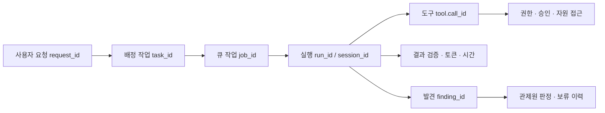

# Wazuh에서 AI 에이전트 관제하기

[프로젝트 안내](../README.md) · [관제 화면·수집 구조](OBSERVABILITY.ko.md) · [교수 매뉴얼](INSTRUCTOR-GUIDE.ko.md) · [학생 매뉴얼](STUDENT-GUIDE.ko.md)

이 매뉴얼은 **누가 어떤 요청 때문에, 어떤 설정과 권한으로, 어느 자원에 접근했고, 어떤 결과와 비용을 남겼는가**를 Wazuh에서 조사하는 방법입니다. 교수는 관제 환경을 준비하고, 학생은 실제 기록을 검색해 전문가의 업무 절차와 에이전트의 행동을 비교합니다.

기준 환경은 이 저장소의 **Wazuh 4.10.0**, 관제 문서 규약은 **`kt66.siem.v2`**입니다. 메뉴 설명은 기본 영문 UI 기준입니다. 최신 Wazuh에서는 메뉴 묶음 이름이 다를 수 있습니다.

## 1. 먼저 알아둘 구조

에이전트 기록은 Wazuh Indexer의 전용 인덱스에 저장됩니다. **Wazuh Dashboard의 Discover·Visualize·Dashboards에서 조회**합니다. Wazuh Manager의 디코더·XML 규칙 엔진에 투입하는 방식이 아니므로, 전용 인덱스에 문서가 생겼다는 이유만으로 Wazuh 보안 경보나 Active Response가 발생하지 않습니다.

현재 에이전트 탐지는 KT66의 `agents/xoc/rules.yaml`과 결정론 탐지기가 수행합니다. Wazuh에서 별도 실시간 탐지를 추가하려면 지원되는 Indexer 모니터 기능이나 Manager 수집·규칙 경로를 별도로 설계해야 합니다. 이 변경은 자동 차단이나 외부 알림을 추가하지 않습니다.

| 인덱스 패턴 | 내용 | 시간 필터 |
|---|---|---|
| `kt66-agent-events-*` | 도구, 설명, 세션 결과, 요청 상태, 승인·회수·관제 이력 | `@timestamp` |
| `kt66-agent-findings-v1` | 탐지별 **현재** 상태 | 현재 미종결 목록은 시간 필터 없이 사용 |
| `kt66-agent-tickets-v1` | 업무 보고서 | `@timestamp` |
| `wazuh-alerts-*` | 기존 인프라·네트워크 보안 경보 | 기존 `timestamp` |

`findings-v1`, `tickets-v1`이라는 물리 인덱스 이름은 유지했습니다. **문서의 `schema_version`은 v2**입니다. 이벤트의 UTC 날짜·문서 ID를 유지한 채 기존 증적을 다시 변환하므로, 정상 이행에서는 기존 기록이 중복되지 않습니다.



`correlation.trace_id`는 KT66 업무 상관키입니다. 요청 ID, 위임에 전달된 상관키, 큐 작업 ID, 실행 ID 순서로 결정하고 `trace_basis`에 근거를 남깁니다. OpenTelemetry 네이티브 trace/span을 수집했다는 의미가 아닙니다.

## 2. 교수: 수집 준비와 업그레이드

프로젝트 루트에서 실행합니다. 기존 서비스를 설치한 서버도 **매핑 추가 → 수집기 교체** 순서를 지킵니다.

```bash
docker compose -f docker-compose.yaml up -d --build --no-deps agent-observer-setup
docker compose -f docker-compose.yaml logs --tail=20 agent-observer-setup
docker compose -f docker-compose.yaml ps -a agent-observer-setup
# '준비 완료', Exited (0)를 확인한 뒤
docker compose -f docker-compose.yaml up -d --build --no-deps agent-observer agentops
```

초기화는 템플릿뿐 아니라 **기존 KT66 인덱스의 매핑에도 새 필드를 추가**합니다. 기존 필드 형식·문서·볼륨은 삭제하지 않습니다. 수집기는 변환 버전 변경을 감지해 원본 파일의 커서를 초기화하고 같은 ID로 재적재합니다. 전송 대기열과 원본 증거는 유지됩니다.

`http://<서버 IP>:8050/xoc`에서 수집 상태가 `running`, 전송 대기·문서 오류·원본 오류가 모두 0인지 확인합니다. 이행 중에는 `backfill`이 표시될 수 있습니다. 기존 원본에 없던 값은 소급 생성되지 않습니다.

새 도구 호출 시간·세션 실행 시간·위임 부모 연결을 기록하려면 실행기 코드도 갱신되어야 합니다. **진행 중인 작업이 없는 시점**에 실행기 사용자의 셸에서 다음을 실행합니다. 서비스가 이미 중지되어 있다면 수업 운영 계획에 맞춰 시작하세요.

```bash
systemctl --user restart kt66-runner.service
```

상시 수집기와 관제 화면은 모델을 호출하지 않습니다. 실행기를 시작하거나 실제 조사 요청을 하면 기존 운영 정책에 따라 모델 사용량이 발생할 수 있습니다.

### 접근 계정

- Wazuh 로그인은 **Wazuh 사용자 계정**입니다. NOC 강사 키·모델 구독 로그인과 다릅니다.
- `kt66_observer_writer`는 수집 전용, `kt66_observer_reader`는 KT66 웹 서버 조회 전용입니다. 학생에게 비밀번호를 배포하지 않습니다.
- 교수는 저장 객체를 가져올 권한과 전용 인덱스 조회 권한이 필요합니다.
- 학생용 Wazuh 계정은 관리 화면에서 별도로 구성합니다. 전용 인덱스에 검색·문서 읽기·필드/매핑 조회, 대시보드 저장 객체에 읽기 권한만 부여합니다. SOC 수업 때만 `wazuh-alerts-*` 읽기를 추가합니다. 문서 쓰기·삭제·보안 관리 권한은 부여하지 않습니다.
- 기본 구성은 멀티테넌시가 꺼져 있습니다. 별도 테넌트를 사용하려면 먼저 Wazuh 설정과 역할 정책을 구성하고 해당 테넌트로 전환한 뒤 객체를 가져옵니다.

## 3. Wazuh에 검색·대시보드 한 번에 등록

1. `https://<서버 IP>:5601`에 접속합니다. 실습 인증서를 사용하는 환경은 교수의 CA/DNS 설정을 따릅니다.
2. [대시보드 가져오기 파일](wazuh/kt66-agent-observatory.ndjson)을 다운로드합니다. 저장소 화면에서는 **Raw/Download raw file**로 저장합니다.
3. 왼쪽 메뉴 → **Dashboard management → Saved objects**로 이동합니다. 버전에 따라 Dashboard management 하위에 동일 이름의 메뉴가 한 단계 더 있습니다.
4. **Import**에서 NDJSON 파일을 선택합니다. 최초 등록은 덮어쓰기 없이 가능합니다. 같은 KT66 객체를 업데이트할 때는 먼저 Export로 보관하고 덮어쓰기를 선택합니다.
5. **15개 객체**를 확인합니다: 인덱스 패턴 3개, 저장 검색 6개, 시각화 5개, 대시보드 1개.
6. **Explore → Dashboards**에서 **`KT66 · AI 에이전트 정밀 관제`**를 엽니다.

이 파일은 `kt66-…-v2`라는 전용 ID만 사용하며 기본 Wazuh 대시보드를 교체하지 않습니다. 자동 새로고침은 처음에는 꺼져 있습니다. 관제 중에는 30초 이상으로 설정할 수 있습니다.

| 패널 | 읽는 방법 |
|---|---|
| 현재 미종결 발견 | 발생 시각과 관계없이 현재 `open`·`acknowledged` 상태 |
| 도구별 실행·거절·오류 | 선택 기간의 `kind:tool`만 집계 |
| 실측 토큰 | `kind:session AND usage_known:true`만 합산 |
| 세션 관측 누락 | 시간·사용량·검증 등 없는 필드를 별도로 표시 |
| 설정별 실행 품질 | 근무자·하네스 버전·실행 종료 상태, 실측 평균 실행 시간 |
| 도구·권한 조사 | 요청·실행·호출 ID와 실제 접근 증적을 찾는 상세 목록 |

전역 필터는 모든 패널에 적용됩니다. `kind:tool` 같은 유형 필터를 대시보드 전체에 걸면 발견 패널이 사라질 수 있습니다. 개별 조사에서는 해당 저장 검색을 Discover에서 여세요. 현재 발견 패턴은 시간 필드를 지정하지 않았기 때문에 과거에 발생한 미종결 사건도 유지됩니다.

필드가 안 보이면 **Index patterns → 해당 KT66 패턴 → Refresh field list**를 실행합니다. 자동으로 만든 패턴과 수동 패턴이 중복되어 있으면 객체 참조를 먼저 확인한 뒤 교수에게 정리를 요청합니다.

### 수동으로 패턴 만들기

가져오기를 사용하지 않을 때는 **Dashboard management → Index patterns → Create index pattern**에서 위 표의 패턴을 각각 생성합니다. 이벤트·보고서는 `@timestamp`, 현재 발견은 **시간 필터를 사용하지 않음**을 선택합니다. 이 패턴을 Wazuh 앱의 기본 `wazuh-alerts-*` 대신 지정할 필요는 없습니다.

## 4. 필드 읽는 법

전체 형식의 정본은 [schema.py](../observability/schema.py), 원본을 어떤 필드로 옮기는지는 [enrichment.py](../observability/enrichment.py)입니다. 임의 JSON 필드를 자동 생성하지 않는 `dynamic: strict` 매핑을 사용합니다.

| 질문 | 필드 | 출처·주의점 |
|---|---|---|
| 누가 실행했나? | `worker`, `role`, `runtime`, `model` | 실행 사본·브로커·런타임 기록. Wazuh의 호스트 `agent.id`와 다름 |
| 무슨 요청·작업인가? | `correlation.request_id`, `task_id`, `request_revision`, `job_id` | 실행 당시 job/manifest. `kind:request`의 `request.title`로 제목 검색 |
| 같은 업무의 실행인가? | `correlation.trace_id`, `trace_basis`, `session_id`, `run_id` | 공통 업무와 개별 실행을 구분 |
| 누가 위임했나? | `correlation.parent_run_id`, `parent_call_id`, `depends_on_task_ids`, `delegation.*` | 새 위임/계획은 브로커가 기록. 과거 부모 정보는 추정하지 않음 |
| 재시도·승인 후 재개인가? | `correlation.attempt`, `retry_of_run_id`, `resumed_from_task_id`, `execution.retry_reason` | 기술적 재시도·승인 재개·에이전트가 보고한 재작업은 서로 다름 |
| 왜 시작했나? | `trigger`, `execution.trigger_source`, `trigger_event_id`, `trigger_reason`, `requested_at` | 원본에 있는 트리거 설명만 저장 |
| 어떤 설정이 적용됐나? | `config.harness_version`, `policy_sha256`, `persona_sha256`, `instructions_sha256`, `native_sources_sha256`, `implementation_sha256` | 원본/실행 사본의 해시. 설정 변경 전후 비교에 사용 |
| 어떤 스킬을 썼나? | `config.assigned_skills`, `tool.skill_name`, `tool.skill_sha256` | **배정 목록과 성공한 `skill_read` 영수증은 별도**. 읽었다고 올바르게 적용한 것은 아님 |
| 어떤 도구·입력인가? | `tool.call_id`, `tool.name`, `argument_names`, `arguments_sha256`, `result_status` | 입력의 필드명·해시만 저장. 전체 인수/결과는 원본 증적 |
| 어떤 자원·파일에 접근했나? | `resource.type`, `id`, `operation`, `purpose` | `nested` 배열. 브로커 접근 기록이며 커널 수준 감사가 아님. `operation:requested`는 요청 대상일 뿐 실제 접근 증명이 아님 |
| 정책과 실제 판정은? | `access_policy.required_permission`, `configured_mode`, `effective_decision`, `boundary`, `autonomy` | 정책상 `allow`여도 직무 경계로 `denied`일 수 있음. `observed`는 영수증 관측이지 업무 성공이 아님 |
| 누가 어떤 승인을 했나? | `approval.request_id`, `grant_id`, `decision`, `actor`, `decided_at`, `boundary` | 승인 객체를 `nested`로 보존. 과거 영수증에 승인자가 없으면 없음으로 유지 |
| 허용을 회수했나? | `kind:approval`, `name:grant.revoked`, `approval_refs`, `actor.id` | 원장에 남아 있는 승인·보류·회수 이력. 과거에 지워진 이력을 복원하지 않음 |
| 상황·계획·판단 근거는? | `explanation.stage`, `summary`, `steps`, `evidence_refs`, `rework_cause` | 에이전트의 **명시적 운영 설명**. 비공개 내부 추론이 아님 |
| 결과가 검증됐나? | `quality.task_status`, `response_kind`, `observed_live_evidence`, `verification_basis`, `artifacts` | `receipt_presence`는 실측 영수증 존재 검사이며 업무 정답·보안성 인증이 아님 |
| 얼마나 걸렸나? | `execution.started_at`, `ended_at`, `duration_ms`; `tool.duration_ms` | 신규 실행에서 단조 시계로 측정. 과거 파일 수정 시각으로 시간을 계산하지 않음 |
| 토큰은 얼마나 썼나? | `usage.input_tokens`, `output_tokens`, `cache_read_tokens`, `cache_creation_tokens`, `total_tokens` | 세션 결과에서만 기록. 실제 과금액·구독 잔여량은 계측하지 않음 |
| 누가 누구를 관제했나? | `actor.id`, `subject.worker`, `subject.run_id`, `correlation.finding_id` | 조치 주체와 사건 대상 구분. 기존 `worker`만으로 혼동하지 않기 |
| 어떤 규칙·증거인가? | `detection.rule_id`, `rule_version`, `risk`, `likelihood`, `impact`, `evidence_items.*` | 현재 발견에 탐지 시점 규칙 버전·증거 해시 저장 |
| 무엇을 모르는가? | `coverage.missing`, `resource_truncated`, `approval_truncated`, `usage_known`, `time_basis` | 누락·상한 절단·시각의 근거를 확인 |

`keyword`는 정확한 필터·집계, `long`은 수치, `date`는 시각, `boolean`은 참/거짓, `text`는 문장 검색에 사용합니다. 자원·승인·증거 쌍은 `nested`입니다. 간편 목록용 `resource_paths`, `resource_operations`, `approval_decisions`는 다중 값 요약이므로 **같은 배열 원소 간 관계를 증명하지 못합니다**.

### 집계 시 꼭 지킬 기준

- `kind:session` 결과만 토큰 합산합니다. `result.json`과 `session-result.json`은 같은 문서 ID로 갱신합니다.
- 업무의 최종 `result.json`이 없으면 `failure.json`을 중간 `session-result.json`보다 우선합니다. 모델 응답 뒤 검증 실패도 실패로 표시하되, 이미 측정된 사용량은 보조 증거 해시와 함께 보존합니다.
- Codex 입력 토큰에는 캐시 읽기가 포함됩니다. Claude 입력은 캐시 읽기·생성을 별도로 더합니다. **합계는 `usage.total_tokens`를 사용**하세요.
- `usage_known:false` 또는 필드 없음은 미측정입니다. 0원·무료·0초로 해석하지 않습니다.
- 세션 문서의 `@timestamp`는 기존 정책대로 실행 시작 시각입니다. 종료 시각 조사는 `execution.ended_at`을 사용합니다.
- 요청/승인 상태 문서는 생성 시각에 놓인 **현재 상태 스냅샷**입니다. 당시 시점의 상태가 필요하면 별도 결정 이력과 원본을 함께 확인합니다.
- 시설 변경의 독립 승인은 `name:change_approval.state`와 해당 도구 영수증으로 조사합니다. `approved`는 승인 결정이며 실제 실행 결과는 `status:verified/verification_failed/execution_failed`로 구분합니다. 도구 사용의 `once/always/defer` 승인과 다른 절차입니다.
- `exposure`는 접근 영향 등급, `risk`는 탐지 규칙의 가능성×영향도입니다. 둘을 동일 점수로 더하지 않습니다.

## 5. 학생: Discover 검색 실습

**Explore → Discover**에서 `kt66-agent-events-*`를 선택하고, 시간 범위를 먼저 넓힌 뒤 검색합니다. 아래는 **DQL 모드** 예시입니다. Wazuh Manager API의 WQL 문법과 다릅니다. 가져오기 파일의 저장 검색은 Lucene 모드로 저장되어 있으므로 수동 예제를 입력할 때 언어 선택도 확인하세요.

| 조사 목적 | DQL 검색 |
|---|---|
| 새 형식의 기록 | `schema_version: "kt66.siem.v2"` |
| 네트워크 담당의 거절된 도구 | `kind: tool and worker: "network-engineer" and outcome: denied` |
| 정책은 allow지만 직무 경계에서 거절 | `kind: tool and access_policy.configured_mode: allow and outcome: denied` |
| 승인을 기다린 호출 | `kind: tool and outcome: pending` |
| 상시 허용을 사용한 호출 | `kind: tool and approval_decisions: always` |
| 상시 허용 회수 이력 | `kind: approval and name: "grant.revoked"` |
| 실제 스킬 읽기 | `kind: tool and tool.name: skill_read and tool.skill_sha256: *` |
| 재작업 설명 | `kind: activity and quality.rework_reported: true` |
| 실행 실패 | `kind: session and outcome: error` |
| 실측 근거가 없었던 결과 | `kind: session and quality.observed_live_evidence: false` |
| 검증 계측 자체가 없는 결과 | `kind: session and coverage.missing: "quality.observed_live_evidence"` |
| 기술적 재시도 | `kind: session and correlation.attempt > 1` |
| 도구 입력·출력 원문 찾기 | `run_id: "실제 실행 ID" and tool.call_id: "실제 호출 ID"` |

처음 볼 컬럼은 `@timestamp`, `worker`, `kind`, `name`, `outcome`, `correlation.request_id`, `run_id`, `tool.call_id`, `evidence_ref`를 권장합니다. 왼쪽 필드 목록에서 **+**로 추가하고 **Save**로 검색을 저장합니다. 기록을 펼쳐 JSON을 보면 nested 접근·승인 쌍을 확인할 수 있습니다.

요청 제목을 모를 때는 `kind:request and request.title: "디스크"`로 찾습니다. 해당 `correlation.request_id`를 복사한 뒤 유형 제한을 지우고 `correlation.request_id: "복사한 ID"`로 검색합니다. 제목만 SIEM에 보내며 대화 원문은 인증된 KT66 업무 화면에서 확인합니다.

## 6. 사건 한 건을 끝까지 추적하기

### 예: 네트워크 담당이 디스크 조회를 시도했다

1. `kt66-agent-findings-v1`에서 `worker: "network-engineer"`와 미종결 상태를 검색합니다. 발견이 없으면 이벤트 패턴에서 실제 `outcome:denied` 영수증부터 찾습니다. 역할 안내만 한 경우에는 거절 이벤트가 없을 수 있습니다.
2. `run_id`, `correlation.request_id`, 발견의 `event_id`를 기록합니다. 발견의 `event_id`는 `correlation.finding_id`와 같습니다.
3. 이벤트 패턴에서 같은 요청 ID로 검색하고 시간순으로 정렬합니다. 상황·계획 설명, 호출, 승인 대기/거절, 종료 결과를 비교합니다.
4. `access_policy.configured_mode`, `required_permission`, `boundary`, `effective_decision`을 대조합니다. `allow` 설정만으로 직무 경계를 통과했다고 판단하지 않습니다.
5. `resource`에서 실제 기록된 경로와 작업을 확인합니다. 요청한 target과 브로커 파일 접근 기록을 구분합니다.
6. `approval_refs`로 승인 원장과 호출을 연결합니다. `once`, `always`, `defer`, `grant.revoked`와 승인 시각·승인자를 확인합니다. `actor.id`가 공용 `instructor`이면 개인 신원까지 식별된 것은 아닙니다.
7. `quality.task_status`, `observed_live_evidence`와 실제 산출물을 확인합니다. 세션의 `completed`만 보고 작업 완료를 확정하지 않습니다.
8. KT66 xOC 사건 화면에서 근거와 함께 검토·오탐·종결을 기록합니다. Wazuh에서 원본 문서의 `status`를 직접 고치지 않습니다. 수집기가 정본을 다시 반영합니다.

위임은 `delegation.id → correlation.parent_run_id/parent_call_id`로 이어서 조사합니다. 계획 기반 협업은 같은 요청 ID의 `task_id`·`depends_on_task_ids`로 확인합니다. 부모 연결이 없는 과거 기록을 시간 인접성만으로 같은 위임이라고 단정하지 않습니다.

### 예: 스킬 변경 후 재작업·비용이 늘었다

1. `kind:tool and tool.name:skill_read`에서 스킬명·실제 읽은 해시와 실행 ID를 찾습니다.
2. 해당 실행들의 `config.harness_version`, 모델, 업무 종류를 구분합니다. 배정 목록만으로 스킬 사용을 단정하지 않습니다.
3. 세션 문서의 토큰·실행 시간·실측 근거와 활동 문서의 `rework_cause`를 비교합니다. 서로 다른 문서이므로 Discover에서 실행 ID를 연결하거나 분석용으로 추출해야 합니다.
4. 같은 난이도의 평가 사례와 기간으로 비교합니다. 시간·토큰이 없는 세션 수, 표본 수, 업무 정답 검증 결과도 보고합니다. 설정별 집계는 인과관계 증명이 아닙니다.

## 7. 정확한 배열 조건과 통계: Indexer Dev Tools

왼쪽 메뉴 **Indexer management → Dev Tools**에서 실행합니다. Wazuh Server API 콘솔과 구분하세요. 다음은 읽기 전용 Indexer 검색입니다. [바로 실행할 JSON 쿼리 모음](wazuh/agent-investigations.json)도 제공합니다. `REPLACE_REQUEST_ID`, `REPLACE_ABSOLUTE_PATH`는 실제 값으로 바꿉니다.

### 같은 파일의 write 접근만 찾기

```http
GET kt66-agent-events-*/_search
{
  "size": 50,
  "query": {
    "bool": {
      "filter": [
        {"term": {"kind": "tool"}},
        {"nested": {
          "path": "resource",
          "query": {"bool": {"filter": [
            {"term": {"resource.id": "/실제/경로/파일"}},
            {"term": {"resource.operation": "write"}}
          ]}},
          "inner_hits": {"size": 10}
        }}
      ]
    }
  },
  "sort": [{"@timestamp": "desc"}]
}
```

`resource_paths:A AND resource_operations:write`로만 검색하면 **A를 읽고 B를 쓴 호출**도 잡힐 수 있습니다. 같은 원소 조건에는 위의 nested 쿼리를 사용합니다. 승인자·결정·권한도 `approval` nested 쿼리로 묶습니다.

### 세션 사용량과 미측정 수 함께 보기

```http
GET kt66-agent-events-*/_search
{
  "size": 0,
  "query": {"bool": {"filter": [
    {"term": {"kind": "session"}},
    {"range": {"@timestamp": {"gte": "now-24h"}}}
  ]}},
  "aggs": {
    "workers": {"terms": {"field": "worker", "size": 50}, "aggs": {
      "measured": {"filter": {"term": {"usage_known": true}}, "aggs": {
        "total_tokens": {"sum": {"field": "usage.total_tokens"}}
      }},
      "unmeasured": {"filter": {"bool": {"must_not": [{"term": {"usage_known": true}}]}}},
      "duration_measured": {"filter": {"exists": {"field": "execution.duration_ms"}}, "aggs": {
        "p95_ms": {"percentiles": {"field": "execution.duration_ms", "percents": [95]}}
      }}
    }}
  }
}
```

시간 버킷을 한국 업무 시간으로 비교할 때는 date_histogram에 `time_zone: "Asia/Seoul"`을 지정합니다. 문서 시각은 UTC로 보존됩니다. 도구 이벤트 수를 세션 수로 사용하지 않습니다.

## 8. SOC 경보와 교차 조사

인프라 경보는 기존 `wazuh-alerts-*`에서 조사합니다. 자주 보는 필드는 `timestamp`, `agent.name`, `rule.id`, `rule.level`, `rule.description`, `data.srcip`, `data.dstip`입니다. 필드 존재 여부는 실제 디코더에 따라 달라집니다.

1. SOC 에이전트 실행의 `run_id`, 조회 시각·범위를 증거에서 확인합니다.
2. Wazuh의 `wazuh-alerts-*`에서 동일한 실제 시간 범위·IP·규칙을 검색합니다. 예: DQL `rule.level >= 12`.
3. 에이전트가 제시한 근거와 실제 경보 원문을 대조합니다. `evidence_ref`의 로컬 파일을 URL로 간주해 자동 실행하지 않습니다.
4. 에이전트의 오류·권한 문제는 xOC 발견으로, 침해 징후는 SOC 사건으로 분리하고 상호 증거를 남깁니다.

현재 두 인덱스는 공통 사건 ID로 자동 결합되지 않습니다. IP·시각 일치도 그 자체로 동일 사건의 확정 근거는 아닙니다. Wazuh 경보의 호스트 에이전트와 KT66 AI 근무자를 혼동하지 마세요.

## 9. 문제가 있을 때

| 증상 | 확인·조치 |
|---|---|
| 패턴에 인덱스가 없음 | 초기화 종료 코드, 최초 수집 상태 확인. 인덱스 이름·권한 확인 |
| 새 필드가 안 보임 | 매핑 초기화 → 재적재 완료 → 패턴 필드 목록 새로고침 순서 확인 |
| 0건으로 보임 | 시간 범위, UTC/KST, 패턴·필터·권한, 수집 상태 확인. 수집 오류를 정상 0건으로 해석하지 않기 |
| `strict_dynamic_mapping_exception` | 수집기보다 매핑 배포가 먼저 완료됐는지 확인. 원본·전송함 삭제 금지 |
| schema v1/v2 혼재 | 과거 적재가 진행 중인지 확인. 초기화가 실패했으면 성공 후 재기동 |
| 과거 문서에 시간·부모 ID 없음 | 당시 원본에 없던 항목. `coverage.missing`과 원본 확인, 허위 소급 보정 금지 |
| 토큰 수가 너무 큼 | 세션만 합산했는지, Codex 캐시를 다시 더했는지 확인 |
| 발견 건수가 기간 변경에도 같음 | 현재 미종결 패널은 전체 기간 원장이므로 정상 |
| 가져오기 객체 충돌 | 기존 KT66 객체를 먼저 Export. 의도한 업데이트일 때만 덮어쓰기 |
| 검색이 403 | 인덱스 조회와 저장 객체 권한을 각각 확인. 서비스 수집 계정을 브라우저용으로 재사용하지 않기 |
| 기록이 잘리거나 일부만 검색됨 | `coverage.*_truncated`, 쿼리 `size`, 기간·페이지 확인. 전체 원본은 실행 증적 |

이 구조는 SIEM 조회를 위한 마스킹된 투영본입니다. 원문 프롬프트·대화 전체·비공개 내부 추론·전체 도구 결과를 복제하지 않습니다. 자동 삭제 정책·WORM·개인별 강사 신원·실제 과금액·업무 정답 검증은 이 스키마만으로 제공되지 않습니다. 보존·백업 기준은 [운영 안내](OBSERVABILITY.ko.md#설치와-운영-확인)를 따릅니다.

## 10. 수업 제출물 예시

학생은 요청 ID와 실행 ID, 적용 스킬·설정 버전, 허용·거절·승인 근거, 실제 접근 자원, 결과 검증, 재작업 이유, 실측 토큰·시간, 미측정 항목을 한 장의 조사 보고서로 정리합니다. 설정 전후에 **같은 평가 사례**를 사용하고 성능·품질·비용·권한 경계를 함께 비교합니다.

실습에 운영 장애나 권한 확대가 필수인 것은 아닙니다. 기존 증적과 격리된 테스트 사례만으로도 누락·거절·승인·재작업 흐름을 학습할 수 있습니다.

## 공식 참고 문서

- Wazuh의 [커스텀 대시보드 구성](https://documentation.wazuh.com/current/user-manual/wazuh-dashboard/creating-custom-dashboards.html): 시각화 생성과 대시보드에 추가하는 UI 절차.
- Wazuh의 [Indexer API 시작하기](https://documentation.wazuh.com/current/user-manual/indexer-api/getting-started.html): Dashboard에서 Indexer 검색 실행.
- OpenSearch의 [저장 객체 가져오기·내보내기](https://docs.opensearch.org/latest/dashboards/management/saved-objects/)와 [DQL 문법](https://docs.opensearch.org/latest/dashboards/dql/): 객체 배포·필터 작성.
- OpenSearch의 [nested 검색](https://docs.opensearch.org/latest/query-dsl/joining/nested/)과 [기존 인덱스 매핑 추가](https://docs.opensearch.org/latest/api-reference/index-apis/put-mapping/): 배열 원소 관계 보존·필드 추가 방식.

프로젝트 필드·판정 의미·운영 제한은 위 외부 문서가 아니라 이 저장소의 코드와 매뉴얼을 기준으로 합니다.
